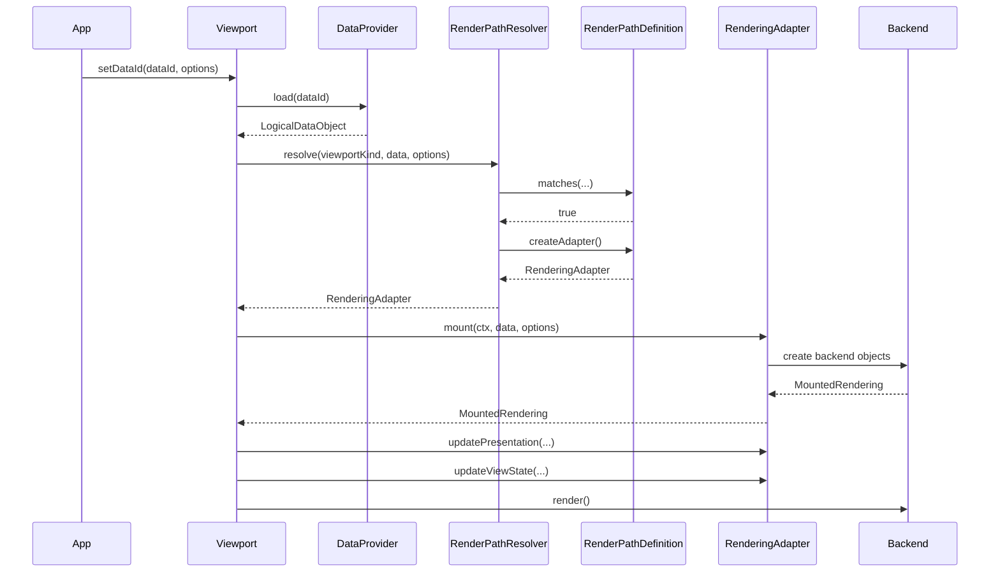

# Viewport Interface Examples

This document shows one logical viewport model that can support multiple rendering pipelines without hardwiring VTK-specific assumptions into the viewport API.

The examples are limited to three viewport families:

- `PlanarViewport`
- `VideoViewport`
- `EcgViewport`

The key architectural choices are:

- one shared `RenderPathResolver` for the whole system
- many registered `RenderPathDefinition`s
- one `RenderingAdapter` per mounted rendering path
- viewport owns logical state; adapters own backend-specific objects

## End-to-end flow



## Shared interfaces

```ts
type ViewportId = string;
type DataId = string;
type RenderingId = string;

type ViewportKind = 'planar' | 'video' | 'ecg';
type DataRole = 'image' | 'video' | 'signal';
type RenderMode = 'slice' | 'reslice' | 'video2d' | 'signal2d';

interface DataAttachmentOptions {
  role: DataRole;
  renderMode: RenderMode;
}

interface BasePresentationProps {
  visible?: boolean;
  opacity?: number;
  interpolationType?: 'nearest' | 'linear' | 'cubic' | 'custom';
}

interface VoiRange {
  windowWidth: number;
  windowCenter: number;
}

interface ImagePresentationProps extends BasePresentationProps {
  voi?: VoiRange;
  slabThickness?: number;
}

interface VideoPresentationProps extends BasePresentationProps {
  playbackRate?: number;
  loop?: boolean;
  muted?: boolean;
}

interface EcgPresentationProps extends BasePresentationProps {
  lineWidth?: number;
  sweepSpeed?: number;
  amplitudeScale?: number;
  showGrid?: boolean;
}

type PresentationProps =
  | ImagePresentationProps
  | VideoPresentationProps
  | EcgPresentationProps;

interface PlanarViewState {
  sliceIndex?: number;
  slicePlane?: 'axial' | 'sagittal' | 'coronal' | 'oblique';
  pan?: [number, number];
  zoom?: number;
  parallelProjection?: boolean;
}

interface VideoViewState {
  zoom?: number;
  pan?: [number, number];
  rotation?: number;
}

interface EcgViewState {
  timeRange: [number, number];
  valueRange: [number, number];
  scrollOffset?: number;
}

type ViewState = PlanarViewState | VideoViewState | EcgViewState;

interface LogicalDataObject {
  id: DataId;
  role: DataRole;
  kind: 'imageVolume' | 'videoStream' | 'signal';
  metadata: Record<string, unknown>;
  payload: unknown;
}

interface MountedRendering {
  id: RenderingId;
  dataId: DataId;
  role: DataRole;
  renderMode: RenderMode;
  backendHandle: unknown;
}

interface ViewportBackendContext {
  viewportId: ViewportId;
  viewportKind: ViewportKind;
}

interface RenderingAdapter {
  mount(
    ctx: ViewportBackendContext,
    data: LogicalDataObject,
    options: DataAttachmentOptions
  ): MountedRendering;

  updatePresentation(
    ctx: ViewportBackendContext,
    rendering: MountedRendering,
    props: PresentationProps
  ): void;

  updateViewState(
    ctx: ViewportBackendContext,
    rendering: MountedRendering,
    viewState: ViewState
  ): void;

  unmount(
    ctx: ViewportBackendContext,
    rendering: MountedRendering
  ): void;
}

interface RenderPathDefinition {
  id: string;
  viewportKind: ViewportKind;

  matches(
    data: LogicalDataObject,
    options: DataAttachmentOptions
  ): boolean;

  createAdapter(): RenderingAdapter;
}

interface RenderPathResolver {
  register(path: RenderPathDefinition): void;

  resolve(
    viewportKind: ViewportKind,
    data: LogicalDataObject,
    options: DataAttachmentOptions
  ): RenderingAdapter;
}

interface DataProvider {
  load(dataId: DataId): Promise<LogicalDataObject>;
}

interface ViewportController<TViewState extends ViewState = ViewState> {
  readonly id: ViewportId;
  readonly kind: ViewportKind;

  setDataId(dataId: DataId, options: DataAttachmentOptions): Promise<RenderingId>;
  removeDataId(dataId: DataId): void;

  setPresentation(dataId: DataId, props: PresentationProps): void;
  getPresentation(dataId: DataId): PresentationProps | undefined;

  setViewState(viewState: Partial<TViewState>): void;
  getViewState(): TViewState;

  render(): void;
}
```

## One shared resolver

The resolver should be shared across the app. It owns all registered render paths and decides which one to use for a given viewport kind, data object, and render mode.

```ts
class DefaultRenderPathResolver implements RenderPathResolver {
  private paths: RenderPathDefinition[] = [];

  register(path: RenderPathDefinition): void {
    this.paths.push(path);
  }

  resolve(
    viewportKind: ViewportKind,
    data: LogicalDataObject,
    options: DataAttachmentOptions
  ): RenderingAdapter {
    const path = this.paths.find(
      (candidate) =>
        candidate.viewportKind === viewportKind &&
        candidate.matches(data, options)
    );

    if (!path) {
      throw new Error(
        `No render path for ${viewportKind}/${data.kind}/${options.role}/${options.renderMode}`
      );
    }

    return path.createAdapter();
  }
}
```

A typical app startup would register all supported paths in one place:

```ts
const resolver = new DefaultRenderPathResolver();

resolver.register(new PlanarImageSlicePath());
resolver.register(new PlanarImageReslicePath());
resolver.register(new VideoElementPath());
resolver.register(new SvgSignalPath());
```

## Shared orchestration

The viewport should not know how to create backend objects directly. It should only:

- load logical data
- ask the shared resolver for a rendering path
- mount that rendering path
- push presentation and view-state updates through the mounted adapter

```ts
interface RenderingBinding {
  data: LogicalDataObject;
  adapter: RenderingAdapter;
  rendering: MountedRendering;
}

abstract class BaseViewport<TViewState extends ViewState>
  implements ViewportController<TViewState> {
  abstract readonly id: ViewportId;
  abstract readonly kind: ViewportKind;

  protected dataProvider: DataProvider;
  protected renderPathResolver: RenderPathResolver;
  protected backendContext: ViewportBackendContext;

  protected bindings = new Map<DataId, RenderingBinding>();
  protected presentations = new Map<DataId, PresentationProps>();
  protected viewState!: TViewState;

  async setDataId(dataId: DataId, options: DataAttachmentOptions) {
    const data = await this.dataProvider.load(dataId);
    const adapter = this.renderPathResolver.resolve(this.kind, data, options);
    const existing = this.bindings.get(dataId);

    if (existing) {
      existing.adapter.unmount(this.backendContext, existing.rendering);
    }

    const rendering = adapter.mount(this.backendContext, data, options);

    this.bindings.set(dataId, {
      data,
      adapter,
      rendering,
    });

    const props = this.presentations.get(dataId);
    if (props) {
      adapter.updatePresentation(this.backendContext, rendering, props);
    }

    adapter.updateViewState(this.backendContext, rendering, this.viewState);
    this.render();
    return rendering.id;
  }

  setPresentation(dataId: DataId, props: PresentationProps) {
    this.presentations.set(dataId, props);
    const binding = this.bindings.get(dataId);
    if (!binding) return;

    binding.adapter.updatePresentation(
      this.backendContext,
      binding.rendering,
      props
    );

    this.render();
  }

  getPresentation(dataId: DataId) {
    return this.presentations.get(dataId);
  }

  setViewState(viewState: Partial<TViewState>) {
    this.viewState = { ...this.viewState, ...viewState };

    for (const binding of this.bindings.values()) {
      binding.adapter.updateViewState(
        this.backendContext,
        binding.rendering,
        this.viewState
      );
    }

    this.render();
  }

  getViewState() {
    return this.viewState;
  }

  removeDataId(dataId: DataId) {
    const binding = this.bindings.get(dataId);
    if (!binding) return;

    binding.adapter.unmount(this.backendContext, binding.rendering);
    this.bindings.delete(dataId);
    this.presentations.delete(dataId);
    this.render();
  }

  abstract render(): void;
}
```

## Example 1: Planar viewport

This viewport handles image data, but it can realize that image through two different render paths:

- `slice` using an `ImageMapper`-style path
- `reslice` using an `ImageResliceMapper`-style path

### Interface

```ts
interface PlanarViewport extends ViewportController<PlanarViewState> {
  readonly kind: 'planar';

  setImage(dataId: DataId, mode: 'slice' | 'reslice'): Promise<RenderingId>;
  setOrientation(plane: 'axial' | 'sagittal' | 'coronal' | 'oblique'): void;
  setSlice(index: number): void;
  scroll(delta: number): void;
}
```

### Concrete viewport implementation

```ts
type PlanarRenderMode = 'slice' | 'reslice';
type SlicePlane = 'axial' | 'sagittal' | 'coronal' | 'oblique';

class PlanarViewportImpl
  extends BaseViewport<PlanarViewState>
  implements PlanarViewport
{
  readonly kind = 'planar' as const;
  readonly id: ViewportId;
  protected backendContext: VtkViewportBackendContext;

  constructor(args: {
    id: ViewportId;
    dataProvider: DataProvider;
    renderPathResolver: RenderPathResolver;
    backendContext: VtkViewportBackendContext;
  }) {
    super();
    this.id = args.id;
    this.dataProvider = args.dataProvider;
    this.renderPathResolver = args.renderPathResolver;
    this.backendContext = args.backendContext;
    this.viewState = {
      slicePlane: 'axial',
      sliceIndex: 0,
      zoom: 1,
      pan: [0, 0],
      parallelProjection: true,
    };
  }

  async setImage(
    dataId: DataId,
    mode: PlanarRenderMode
  ): Promise<RenderingId> {
    return this.setDataId(dataId, {
      role: 'image',
      renderMode: mode,
    });
  }

  setOrientation(plane: SlicePlane): void {
    this.setViewState({ slicePlane: plane });
  }

  setSlice(index: number): void {
    this.setViewState({ sliceIndex: index });
  }

  scroll(delta: number): void {
    this.setSlice((this.viewState.sliceIndex ?? 0) + delta);
  }

  render(): void {
    this.backendContext.renderWindow.render();
  }
}
```

### Types used by the planar adapters

```ts
interface ImageVolumeData extends LogicalDataObject {
  kind: 'imageVolume';
  payload: VtkImageDataLike;
}

interface VtkImageDataLike {
  getBounds(): [number, number, number, number, number, number];
}

interface VtkImageSliceActorLike {
  setMapper(mapper: VtkImageMapperLike | VtkImageResliceMapperLike): void;
  setVisibility(visible: boolean): void;
  setOpacity(opacity: number): void;
  setInterpolationType(mode: 'nearest' | 'linear' | 'cubic' | 'custom'): void;
  setVOI(windowWidth: number, windowCenter: number): void;
}

interface VtkImageMapperLike {
  setInputData(data: VtkImageDataLike): void;
  setSlicingMode(mode: 'X' | 'Y' | 'Z'): void;
  setSlice(slice: number): void;
}

interface SlicePlaneDefinition {
  origin: [number, number, number];
  normal: [number, number, number];
}

interface VtkImageResliceMapperLike {
  setInputData(data: VtkImageDataLike): void;
  setSlicePlane(plane: SlicePlaneDefinition): void;
  setSlicePosition(position: number): void;
}

interface VtkRendererLike {
  addActor(actor: VtkImageSliceActorLike): void;
  removeActor(actor: VtkImageSliceActorLike): void;
}

interface VtkRenderWindowLike {
  render(): void;
}

interface VtkViewportBackendContext extends ViewportBackendContext {
  viewportKind: 'planar';
  renderer: VtkRendererLike;
  renderWindow: VtkRenderWindowLike;
}

interface SliceRendering extends MountedRendering {
  renderMode: 'slice';
  backendHandle: {
    actor: VtkImageSliceActorLike;
    mapper: VtkImageMapperLike;
    imageData: VtkImageDataLike;
  };
}

interface ResliceRendering extends MountedRendering {
  renderMode: 'reslice';
  backendHandle: {
    actor: VtkImageSliceActorLike;
    mapper: VtkImageResliceMapperLike;
    imageData: VtkImageDataLike;
  };
}

function createImageMapper(): VtkImageMapperLike {
  throw new Error('factory provided by backend');
}

function createImageResliceMapper(): VtkImageResliceMapperLike {
  throw new Error('factory provided by backend');
}

function createImageSliceActor(): VtkImageSliceActorLike {
  throw new Error('factory provided by backend');
}

function isImageProps(props: PresentationProps): props is ImagePresentationProps {
  return 'voi' in props || 'slabThickness' in props;
}

function toAxisMode(plane: Exclude<SlicePlane, 'oblique'>): 'X' | 'Y' | 'Z' {
  switch (plane) {
    case 'sagittal':
      return 'X';
    case 'coronal':
      return 'Y';
    case 'axial':
      return 'Z';
  }
}

function createSlicePlaneFromViewState(
  viewState: PlanarViewState,
  imageData: VtkImageDataLike
): SlicePlaneDefinition {
  const bounds = imageData.getBounds();
  const center: [number, number, number] = [
    (bounds[0] + bounds[1]) / 2,
    (bounds[2] + bounds[3]) / 2,
    (bounds[4] + bounds[5]) / 2,
  ];

  switch (viewState.slicePlane) {
    case 'sagittal':
      return { origin: center, normal: [1, 0, 0] };
    case 'coronal':
      return { origin: center, normal: [0, 1, 0] };
    case 'axial':
      return { origin: center, normal: [0, 0, 1] };
    case 'oblique':
    default:
      return { origin: center, normal: [0.707, 0, 0.707] };
  }
}
```

### Registered render paths for planar rendering

```ts
class PlanarImageSlicePath implements RenderPathDefinition {
  readonly id = 'planar:image:slice';
  readonly viewportKind = 'planar' as const;

  matches(data: LogicalDataObject, options: DataAttachmentOptions): boolean {
    return (
      data.kind === 'imageVolume' &&
      options.role === 'image' &&
      options.renderMode === 'slice'
    );
  }

  createAdapter(): RenderingAdapter {
    return new ImageSliceRenderingAdapter();
  }
}

class PlanarImageReslicePath implements RenderPathDefinition {
  readonly id = 'planar:image:reslice';
  readonly viewportKind = 'planar' as const;

  matches(data: LogicalDataObject, options: DataAttachmentOptions): boolean {
    return (
      data.kind === 'imageVolume' &&
      options.role === 'image' &&
      options.renderMode === 'reslice'
    );
  }

  createAdapter(): RenderingAdapter {
    return new ImageResliceRenderingAdapter();
  }
}
```

### Adapters chosen by those paths

```ts
class ImageSliceRenderingAdapter implements RenderingAdapter {
  mount(
    ctx: ViewportBackendContext,
    data: LogicalDataObject,
    options: DataAttachmentOptions
  ): SliceRendering {
    const vtkCtx = ctx as VtkViewportBackendContext;
    const image = data as ImageVolumeData;
    const mapper = createImageMapper();
    const actor = createImageSliceActor();

    mapper.setInputData(image.payload);
    actor.setMapper(mapper);
    vtkCtx.renderer.addActor(actor);

    return {
      id: `rendering:${image.id}:slice`,
      dataId: image.id,
      role: options.role,
      renderMode: 'slice',
      backendHandle: { actor, mapper, imageData: image.payload },
    };
  }

  updatePresentation(
    ctx: ViewportBackendContext,
    rendering: MountedRendering,
    props: PresentationProps
  ): void {
    const { actor } = (rendering as SliceRendering).backendHandle;

    if (props.visible !== undefined) actor.setVisibility(props.visible);
    if (props.opacity !== undefined) actor.setOpacity(props.opacity);
    if (props.interpolationType) actor.setInterpolationType(props.interpolationType);
    if (isImageProps(props) && props.voi) {
      actor.setVOI(props.voi.windowWidth, props.voi.windowCenter);
    }
  }

  updateViewState(
    ctx: ViewportBackendContext,
    rendering: MountedRendering,
    viewState: ViewState
  ): void {
    const { mapper } = (rendering as SliceRendering).backendHandle;
    const planar = viewState as PlanarViewState;

    if (planar.slicePlane && planar.slicePlane !== 'oblique') {
      mapper.setSlicingMode(toAxisMode(planar.slicePlane));
    }
    if (typeof planar.sliceIndex === 'number') {
      mapper.setSlice(planar.sliceIndex);
    }
  }

  unmount(ctx: ViewportBackendContext, rendering: MountedRendering): void {
    const vtkCtx = ctx as VtkViewportBackendContext;
    vtkCtx.renderer.removeActor((rendering as SliceRendering).backendHandle.actor);
  }
}

class ImageResliceRenderingAdapter implements RenderingAdapter {
  mount(
    ctx: ViewportBackendContext,
    data: LogicalDataObject,
    options: DataAttachmentOptions
  ): ResliceRendering {
    const vtkCtx = ctx as VtkViewportBackendContext;
    const image = data as ImageVolumeData;
    const mapper = createImageResliceMapper();
    const actor = createImageSliceActor();

    mapper.setInputData(image.payload);
    actor.setMapper(mapper);
    vtkCtx.renderer.addActor(actor);

    return {
      id: `rendering:${image.id}:reslice`,
      dataId: image.id,
      role: options.role,
      renderMode: 'reslice',
      backendHandle: { actor, mapper, imageData: image.payload },
    };
  }

  updatePresentation(
    ctx: ViewportBackendContext,
    rendering: MountedRendering,
    props: PresentationProps
  ): void {
    const { actor } = (rendering as ResliceRendering).backendHandle;

    if (props.visible !== undefined) actor.setVisibility(props.visible);
    if (props.opacity !== undefined) actor.setOpacity(props.opacity);
    if (props.interpolationType) actor.setInterpolationType(props.interpolationType);
    if (isImageProps(props) && props.voi) {
      actor.setVOI(props.voi.windowWidth, props.voi.windowCenter);
    }
  }

  updateViewState(
    ctx: ViewportBackendContext,
    rendering: MountedRendering,
    viewState: ViewState
  ): void {
    const { mapper, imageData } = (rendering as ResliceRendering).backendHandle;
    const planar = viewState as PlanarViewState;

    mapper.setSlicePlane(createSlicePlaneFromViewState(planar, imageData));
    if (typeof planar.sliceIndex === 'number') {
      mapper.setSlicePosition(planar.sliceIndex);
    }
  }

  unmount(ctx: ViewportBackendContext, rendering: MountedRendering): void {
    const vtkCtx = ctx as VtkViewportBackendContext;
    vtkCtx.renderer.removeActor((rendering as ResliceRendering).backendHandle.actor);
  }
}
```

### What `setImage()` and `setOrientation()` do

```ts
await planarViewport.setImage('ct:1', 'slice');
planarViewport.setOrientation('axial');
planarViewport.setSlice(80);
```

The runtime flow is:

1. `setImage()` calls `setDataId('ct:1', { role: 'image', renderMode: 'slice' })`
2. `DataProvider` loads `ImageVolumeData`
3. shared `RenderPathResolver` searches all registered paths
4. `PlanarImageSlicePath` matches and creates `ImageSliceRenderingAdapter`
5. adapter mounts `ImageMapper + ImageSliceActor`
6. `setOrientation('axial')` updates logical planar view state only
7. `BaseViewport.setViewState(...)` forwards that state to the mounted adapter
8. adapter converts logical state into `mapper.setSlicingMode('Z')`

If the call is:

```ts
await planarViewport.setImage('ct:1', 'reslice');
planarViewport.setOrientation('oblique');
```

then the same resolver picks `PlanarImageReslicePath`, which mounts `ImageResliceMapper`, and `updateViewState(...)` converts orientation into `mapper.setSlicePlane(...)`.

## Example 2: Video viewport

This viewport is for time-based video playback.

### Interface

```ts
interface VideoViewport extends ViewportController<VideoViewState> {
  readonly kind: 'video';

  setVideo(dataId: DataId): Promise<RenderingId>;
  play(): void;
  pause(): void;
  seek(timeMs: number): void;
}
```

### Video-specific types and path definition

```ts
interface VideoStreamData extends LogicalDataObject {
  kind: 'videoStream';
  payload: string;
}

interface VideoViewportBackendContext extends ViewportBackendContext {
  viewportKind: 'video';
  container: HTMLElement;
}

interface VideoRendering extends MountedRendering {
  renderMode: 'video2d';
  backendHandle: {
    element: HTMLVideoElement;
  };
}

class VideoElementPath implements RenderPathDefinition {
  readonly id = 'video:element';
  readonly viewportKind = 'video' as const;

  matches(data: LogicalDataObject, options: DataAttachmentOptions): boolean {
    return (
      data.kind === 'videoStream' &&
      options.role === 'video' &&
      options.renderMode === 'video2d'
    );
  }

  createAdapter(): RenderingAdapter {
    return new HtmlVideoAdapter();
  }
}
```

### Video adapter

```ts
class HtmlVideoAdapter implements RenderingAdapter {
  mount(
    ctx: ViewportBackendContext,
    data: LogicalDataObject,
    options: DataAttachmentOptions
  ): VideoRendering {
    const videoCtx = ctx as VideoViewportBackendContext;
    const video = data as VideoStreamData;

    const element = document.createElement('video');
    element.src = video.payload;
    videoCtx.container.appendChild(element);

    return {
      id: `rendering:${video.id}:video`,
      dataId: video.id,
      role: options.role,
      renderMode: 'video2d',
      backendHandle: { element },
    };
  }

  updatePresentation(
    ctx: ViewportBackendContext,
    rendering: MountedRendering,
    props: PresentationProps
  ): void {
    const { element } = (rendering as VideoRendering).backendHandle;
    const videoProps = props as VideoPresentationProps;

    if (props.visible !== undefined) {
      element.style.display = props.visible ? '' : 'none';
    }
    if (props.opacity !== undefined) {
      element.style.opacity = String(props.opacity);
    }
    if (typeof videoProps.playbackRate === 'number') {
      element.playbackRate = videoProps.playbackRate;
    }
    if (typeof videoProps.loop === 'boolean') {
      element.loop = videoProps.loop;
    }
    if (typeof videoProps.muted === 'boolean') {
      element.muted = videoProps.muted;
    }
  }

  updateViewState(
    ctx: ViewportBackendContext,
    rendering: MountedRendering,
    viewState: ViewState
  ): void {
    const { element } = (rendering as VideoRendering).backendHandle;
    const videoView = viewState as VideoViewState;
    const scale = videoView.zoom ?? 1;
    const [panX, panY] = videoView.pan ?? [0, 0];
    const rotation = videoView.rotation ?? 0;

    element.style.transform =
      `translate(${panX}px, ${panY}px) scale(${scale}) rotate(${rotation}deg)`;
  }

  unmount(ctx: ViewportBackendContext, rendering: MountedRendering): void {
    const { element } = (rendering as VideoRendering).backendHandle;
    element.remove();
  }
}
```

## Example 3: ECG viewport

This viewport is for time-series signal rendering.

### Interface

```ts
interface EcgViewport extends ViewportController<EcgViewState> {
  readonly kind: 'ecg';

  setSignal(dataId: DataId): Promise<RenderingId>;
  setLeadLayout(layout: 'single' | 'stacked' | '12lead'): void;
  setPlaybackTime(timeMs: number): void;
}
```

### ECG-specific types and path definition

```ts
interface SignalData extends LogicalDataObject {
  kind: 'signal';
  payload: number[];
}

interface EcgViewportBackendContext extends ViewportBackendContext {
  viewportKind: 'ecg';
  svgRoot: SVGSVGElement;
}

interface SignalRendering extends MountedRendering {
  renderMode: 'signal2d';
  backendHandle: {
    path: SVGPathElement;
  };
}

class SvgSignalPath implements RenderPathDefinition {
  readonly id = 'ecg:svg-signal';
  readonly viewportKind = 'ecg' as const;

  matches(data: LogicalDataObject, options: DataAttachmentOptions): boolean {
    return (
      data.kind === 'signal' &&
      options.role === 'signal' &&
      options.renderMode === 'signal2d'
    );
  }

  createAdapter(): RenderingAdapter {
    return new SvgSignalTraceAdapter();
  }
}
```

### ECG adapter

```ts
class SvgSignalTraceAdapter implements RenderingAdapter {
  mount(
    ctx: ViewportBackendContext,
    data: LogicalDataObject,
    options: DataAttachmentOptions
  ): SignalRendering {
    const ecgCtx = ctx as EcgViewportBackendContext;
    const signal = data as SignalData;

    const path = document.createElementNS(
      'http://www.w3.org/2000/svg',
      'path'
    );
    ecgCtx.svgRoot.appendChild(path);

    return {
      id: `rendering:${signal.id}:signal`,
      dataId: signal.id,
      role: options.role,
      renderMode: 'signal2d',
      backendHandle: { path },
    };
  }

  updatePresentation(
    ctx: ViewportBackendContext,
    rendering: MountedRendering,
    props: PresentationProps
  ): void {
    const { path } = (rendering as SignalRendering).backendHandle;
    const ecgProps = props as EcgPresentationProps;

    if (props.visible !== undefined) {
      path.style.display = props.visible ? '' : 'none';
    }
    if (props.opacity !== undefined) {
      path.style.opacity = String(props.opacity);
    }
    if (typeof ecgProps.lineWidth === 'number') {
      path.style.strokeWidth = String(ecgProps.lineWidth);
    }
  }

  updateViewState(
    ctx: ViewportBackendContext,
    rendering: MountedRendering,
    viewState: ViewState
  ): void {
    const { path } = (rendering as SignalRendering).backendHandle;
    const ecgView = viewState as EcgViewState;

    path.setAttribute(
      'data-time-range',
      `${ecgView.timeRange[0]}:${ecgView.timeRange[1]}`
    );
    path.setAttribute(
      'data-value-range',
      `${ecgView.valueRange[0]}:${ecgView.valueRange[1]}`
    );
  }

  unmount(ctx: ViewportBackendContext, rendering: MountedRendering): void {
    const { path } = (rendering as SignalRendering).backendHandle;
    path.remove();
  }
}
```

## Overall picture

The shared model is:

- viewport = orchestration and logical state
- `RenderPathResolver` = one shared selector for the whole app
- `RenderPathDefinition` = registration unit for one supported path
- `RenderingAdapter` = runtime object that mounts and updates backend objects
- backend context = where those backend objects live

So:

- `PlanarViewport` can choose between `ImageMapper` and `ImageResliceMapper`
- `VideoViewport` can choose an HTML video path
- `EcgViewport` can choose an SVG signal path

without changing the core viewport contract.
