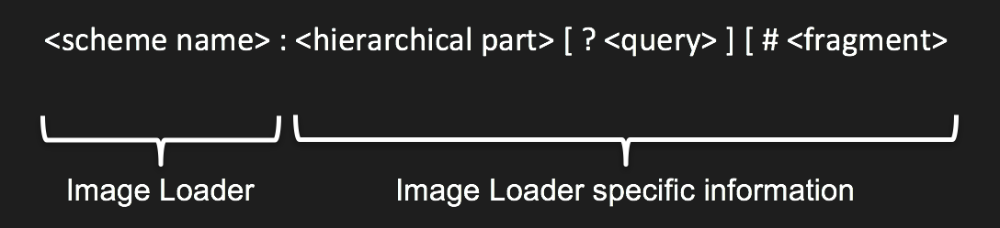

# ImageId

A Cornerstone-3D ImageId is the same concept as ImageId in Cornerstone. ImageId is a URL which identifies a single image for cornerstone to display.

The URL scheme in the ImageId is used by Cornerstone to determine which [Image Loader](./imageLoader.md) plugin to call to actually load the image. This strategy allows Cornerstone to simultaneously display multiple images obtained with different protocols from different servers. For example, Cornerstone could display a DICOM CT image obtained via WADO alongside a JPEG dermatology image captured by a digital camera and stored on a file system.

The ImageId format

Cornerstone does not specify what the contents of the URL are - it is up to the Image Loader to define the contents and format of the URL so that it can locate the image. For example, a proprietary Image Loader plugin could be written to talk to a proprietary server and lookup images using a GUID, filename or database row id.

Here are some examples of what an ImageId could look like for different Image Loader plugins:

- example://1
- dicomweb://server/wado/{uid}/{uid}/{uid}
- http://server/image.jpeg
- custom://server/uuid
- wadors://server/{StudyInstanceUID}/{SeriesInstanceUID}/{SOPInstanceUID}
- csiv://server/{StudyInstanceUID}/{SeriesInstanceUID}/{SOPInstanceUID}
