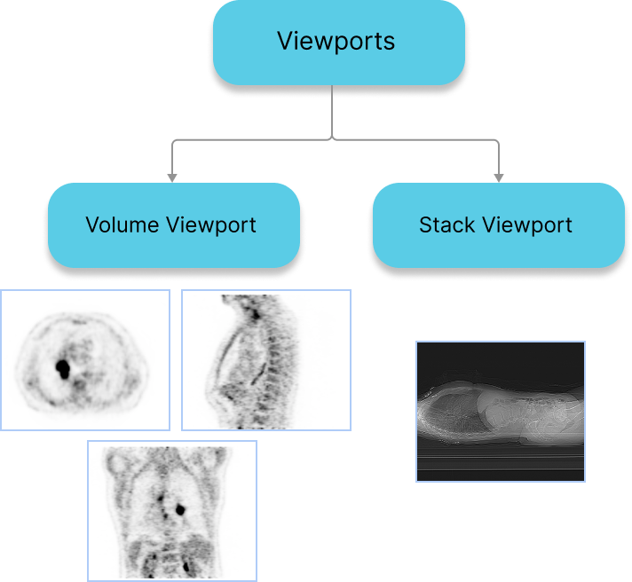

# Viewports

A viewport can be thought of as:

- A camera viewing an image from a specific perspective.
- A canvas to display the output of this camera.

In `Cornerstone3D` viewports are created from HTML elements, and the consumer should
pass the `element` for which the viewport should be created. For example, a CT series can be
viewed via 4 viewports in a “4-up” view: Axial MPR, Sagittal MPR, Coronal MPR, A 3D perspective volume render.

## StackViewport

- Suitable for rendering a stack of images, that might or might not belong to the same image.
- Stack can include 2D images of various shapes, size and direction

## VolumeViewport

- Suitable for rendering a volumetric data which is considered as one 3D image.
- Having a VolumeViewport enables Multi-planar reformation or reconstruction (MPR) by design, in which you can visualize the volume from various different orientations without addition of performance costs.
- For having image fusion between two series

## 3D Viewport

- Sutiable for actual 3D rendering of a volumetric data.
- For having different types of presets such as Bone, Soft Tissue, Lung, etc.

:::note

Both `StackViewport` and `VolumeViewport`, `VolumeViewport3D` are created via the `RenderingEngine` API.

:::
