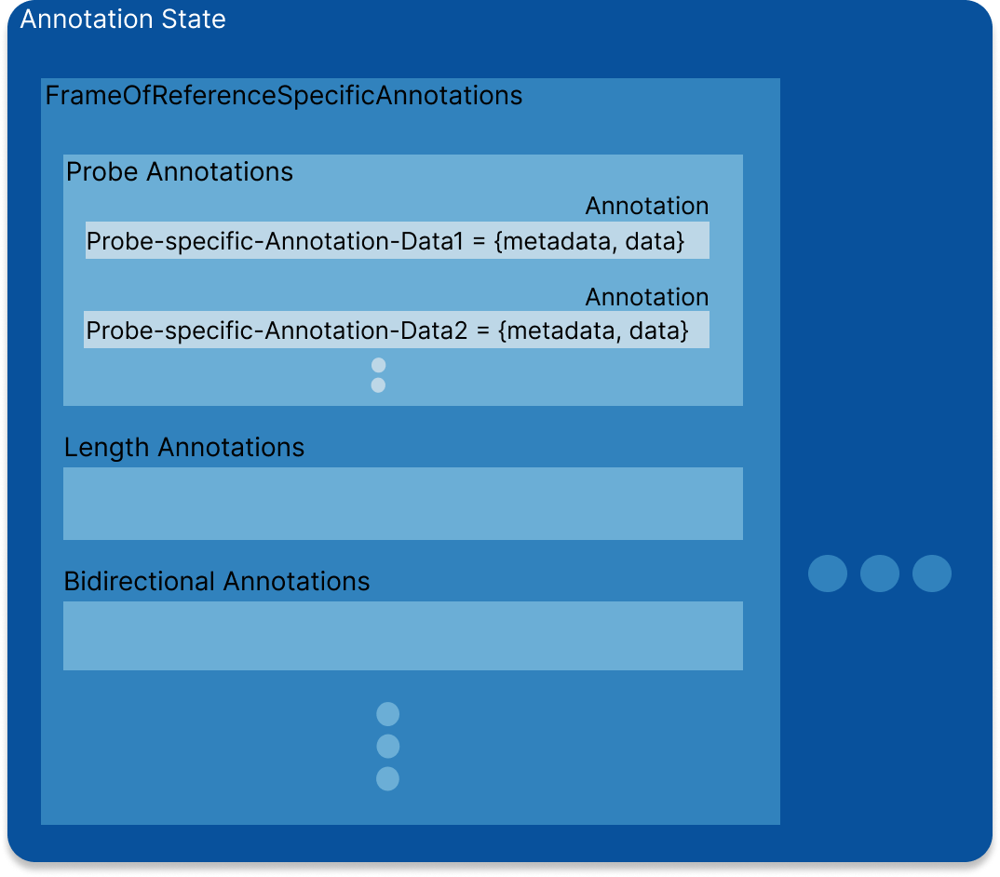

# State Management

`Cornerstone3DTools` implements a `FrameOfReference` annotations state manager, where annotations use world coordinates for points.

## Annotation Data

When a new annotation is created (`addNewAnnotation` method in the annotation tools), a new annotation data is created
based on the metadata and the current state of the tool, and it gets added to the global annotation state.

In the following we show the annotation data for a `ProbeTool` instance. Other tools, basically follow the same pattern.

```js
// ProbeTool Annotation Data
const annotation = {
  invalidated: boolean, // Whether the annotation data has been invalidated by e.g., moving its handles
  highlighted: boolean, // Whether the annotation is highlighted by mouse over
  annotationUID: string, // The UID of the annotation
  metadata: {
    viewPlaneNormal: Types.Point3, // The view plane normal of the camera
    viewUp: Types.Point3, // The view up vector of the camera
    FrameOfReferenceUID: string, // viewport's FrameOfReferenceUID the annotation has been drawn on
    referencedImageId?: string, // The image ID the annotation has been drawn on (if applicable)
    toolName: string, // The tool name
  },
  data: {
    handles: {
      points: [Types.Point3], // The handles points in world coordinates (probe tool = 1 handle = 1 x,y,z point)
    },
    cachedStats: {}, // Stored Statistics for the annotation
  },
}
```

## Annotation State

Annotations state keeps track of the annotations for each FrameOfReference. The state
is composed of a `FrameOfReference`-specific state object, in which each annotation-specific
state is stored. Below, you can see a high-level overview of the state object.

<div style={{textAlign: 'center', width:"80%"}}>



</div>

## API

You can get/add annotations using the following API:

```js
// Adds annotation
cornerstone3DTools.annotations.state.addAnnotation(
  annotation,
  element,
  suppressEvents
);

// Remove the annotations given the annotation reference.
cornerstone3DTools.annotations.state.removeAnnotation(
  annotationUID,
  suppressEvents
);

// Returns the full annotations for a given Tool
cornerstone3DTools.annotations.state.getAnnotations(element, toolName);

// A helper which returns the single annotation entry matching the UID.
cornerstone3DTools.annotations.state.getAnnotation(annotationUID);
```

## Read more

:::note TIP
Read more about the state API [here](/api/tools/namespace/annotation#state)
:::
