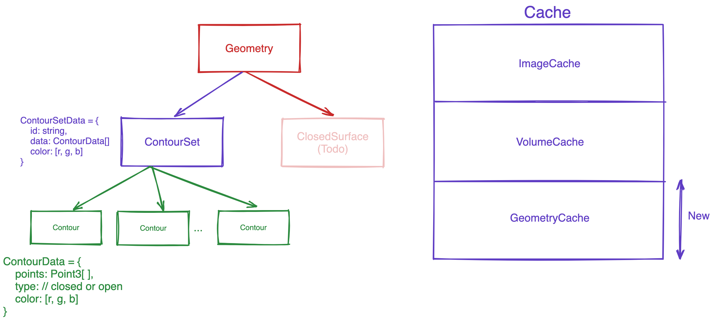

# Contour Segmentation Representation

A Contour Segmentation Representation is a collection of Contour Sets. Each Contour Set is a collection of Contours. Each Contour is a collection of Points. Each Point is a collection of 3D coordinates.



## Contour Set

Since usually a segmentation is a collection of multiple structures, each Contour Set represents a single structure. For example, a segmentation can have multiple Contour Sets, each representing a different structure. Each Contour Set has a unique ID, and a name. The name is used to display the structure name in the UI.

## Contour

A Contour includes the information about the points that make up the contour. Each Contour has data, type (closed or open), and a color.

## Loading Contour as Segmentation Representation

```js
// load each contour set and cache the geometry
const promises = contourSets.map((contourSet) => {
  return geometryLoader.createAndCacheGeometry(contourSet.id, {
    type: GeometryType.CONTOUR,
    geometryData: contourSet as Types.PublicContourSetData,
  });
});

await Promise.all(promises);

// Add the segmentations to state
segmentation.addSegmentations([
  {
    segmentationId,
    representation: {
      // The type of segmentation
      type: csToolsEnums.SegmentationRepresentations.Contour,
      // The actual segmentation data, in the case of contour geometry
      // this is a reference to the geometry data
      data: {
        geometryIds: contourSets.map((contourSet) => contourSet.id),
      },
    },
  },
]);

// add segmentation representation
await segmentation.addSegmentationRepresentations(toolGroupId, [
  {
    segmentationId,
    type: csToolsEnums.SegmentationRepresentations.Contour,
  },
]);
```
