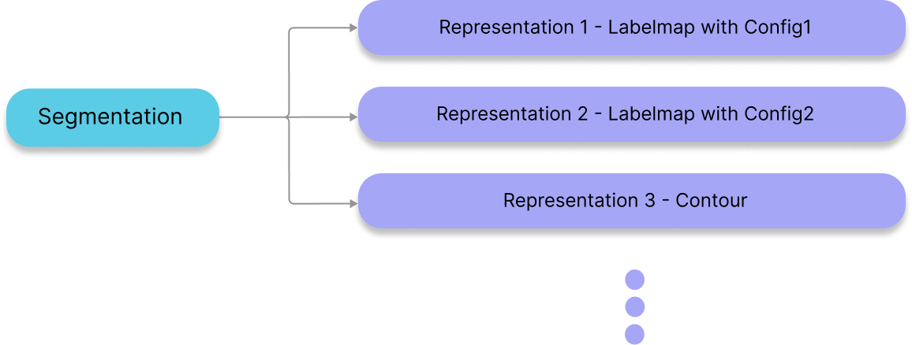

import DocCardList from '@theme/DocCardList';
import {useCurrentSidebarCategory} from '@docusaurus/theme-common';

# Segmentations

In `Cornerstone3DTools`, we have decoupled the concept of a `Segmentation` from
a `Segmentation Representation`. This means that from one `Segmentation` we can
create multiple `Segmentation Representation`s. For instance, a `Segmentation Representation`
of a 3D Labelmap, can be created from a `Segmentation` data, and a `Segmentation Representation`
of a Contour (not supported yet) can be created from the same `Segmentation` data. This
way we have decouple the presentational aspect of a `Segmentation` from the underlying data.



:::note TIP
Similar relationship structure has been adapted in popular medical imaging softwares
such as [3D Slicer](https://www.slicer.org/) with the addition of [polymorph segmentation](https://github.com/PerkLab/PolySeg).
:::

## ToolGroup Specific Representations

Previously in `Cornerstone (legacy)` we applied `Segmentations` to elements.
This had its own limitations, such as: repetitive creation of `Segmentations` for each viewport
(ct-axial, ct-sagittal, and ct-coronal). We have changed this to apply a `Segmentation Representation`
to a `ToolGroup` which accordingly applies to all viewports.

## Segmentation Display

`Cornerstone3DTools` treats segmentations the same way as any other Tool. For instance,
the `SegmentationDisplayTool` should be added via `addTools` and also be added to the `ToolGroup`
whose viewports you want to display the segmentation on. We will read more
about this in the next section.

## API

`Segmentation` related functions and classes are available in the `segmentation` module.

```js
import { segmentation } from '@cornerstonejs/tools';

// segmentation state holding all segmentations and their toolGroup specific representations
segmentation.state.XYZ;

// active segmentation methods (set/get)
segmentation.activeSegmentation.XYZ;

// locking for a segment index (set/get)
segmentation.locking.XYZ;

// segment index manipulations (set/get)
segmentations.segmentIndex.XYZ;
```

Let's start by looking deeper into each of these methods.

<DocCardList items={useCurrentSidebarCategory().items}/>
