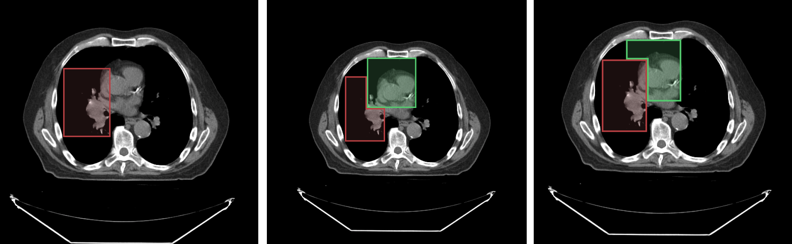

# Segment Locking





You can lock specific segments in a segmentation to prevent them from being modified by any tools.

For example, consider the following image with an overlaid labelmap:
- Left image: shows `segment index 1`
- Middle image: shows the result when `segment index 2` is drawn on top of `segment index 1`
- Right image: shows the result when `segment index 1` is locked and `segment index 2` is drawn on top of `segment index 1`

As shown in the locked scenario (right image), when segment index 1 is locked, it cannot be modified by new drawings.

![segment-locking-example]

## API

The locking API has been updated in version 2.x to provide clearer method names and functionality:

```js
import { segmentation } from '@cornerstonejs/tools';

// Lock/unlock a segment index in a segmentation
segmentation.locking.setSegmentIndexLocked(
  segmentationId,
  segmentIndex,
  locked
);

// Get all locked segment indices for a segmentation
const lockedIndices = segmentation.locking.getLockedSegmentIndices(segmentationId);

// Check if a segment index is locked
const isLocked = segmentation.locking.isSegmentIndexLocked(
  segmentationId,
  segmentIndex
);
```

### Example Usage

```js
// Lock segment 1 in a segmentation
segmentation.locking.setSegmentIndexLocked('segmentation1', 1, true);

// Check if segment 1 is locked
const isLocked = segmentation.locking.isSegmentIndexLocked('segmentation1', 1);
console.log(`Segment 1 is ${isLocked ? 'locked' : 'unlocked'}`);

// Get all locked segments
const lockedIndices = segmentation.locking.getLockedSegmentIndices('segmentation1');
console.log('Locked segment indices:', lockedIndices);

// Unlock segment 1
segmentation.locking.setSegmentIndexLocked('segmentation1', 1, false);
```

### Key Changes in Version 2.x

1. Renamed `getLockedSegments` to `getLockedSegmentIndices` for clarity
2. The locked state is now stored in the segment data structure:
```js
{
  segments: {
    [segmentIndex]: {
      locked: boolean,
      // other segment properties...
    }
  }
}
```

Note that the locking state applies to the segmentation as a whole, not to specific representations or viewports. If a segment is locked, it will be locked across all viewports and representations.
