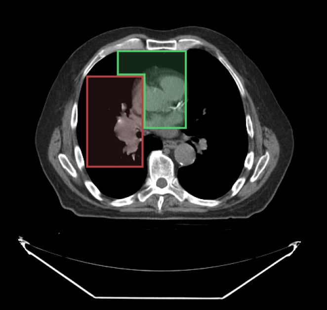

# Segment Index

When drawing with segmentation tools, you can specify which segment index to use. Below, we have used the SegmentIndex API to change the `segmentIndex` to draw the second segment.

<div style={{textAlign: 'center', width: '500px'}}>



</div>

## API

```js
import { segmentation } from '@cornerstonejs/tools';

// get active segment index for the segmentation Id
segmentation.segmentIndex.getActiveSegmentIndex(segmentationId);

// set active segment index for the segmentation Id
segmentation.segmentIndex.setActiveSegmentIndex(segmentationId, segmentIndex);
```
