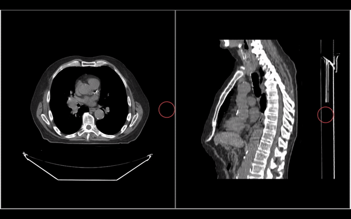

# Segmentation Tools

`Cornerstone3DTools` provides a set of tools to modify segmentations. These include
the `BrushTool`, Scissors (such as `RectangleScissor`, `CircleScissor`, `SphereScissor`),
and `RectangleRoiThresholdTool`. We will cover each tool in more detail below.

:::note Tip
All Segmentation tools can edit the segmentation in all 3D views (axial, coronal, and sagittal).
:::

## Brush Tool

`BrushTool` is the most commonly used tool for segmentation. It allows you to draw
segmentations by clicking and dragging (as seen below).

To use this tool, you need to add it to your toolGroup like any other tools. Read more
on how to activate a tool in [Tools](../tools.md#adding-tools) and [ToolGroup](../toolGroups.md#toolgroup-creation-and-tool-addition) sections.

## Rectangle Scissor Tool

`RectangleScissorTool` can be used to create a rectangular segmentation.

## Circle Scissor Tool

`CircleScissorTool` can be used to create a circular segmentation.

## Sphere Scissor Tool

`SphereScissorTool` can be used to create a spherical segmentation. It draws a 3D
sphere around the mouse pointer.

## Threshold Tool

`RectangleROIThresholdTool` can be used to create a segmentation by thresholding the drawn
area by the user.

(in images below, a certain threshold is set to create a segmentation)

