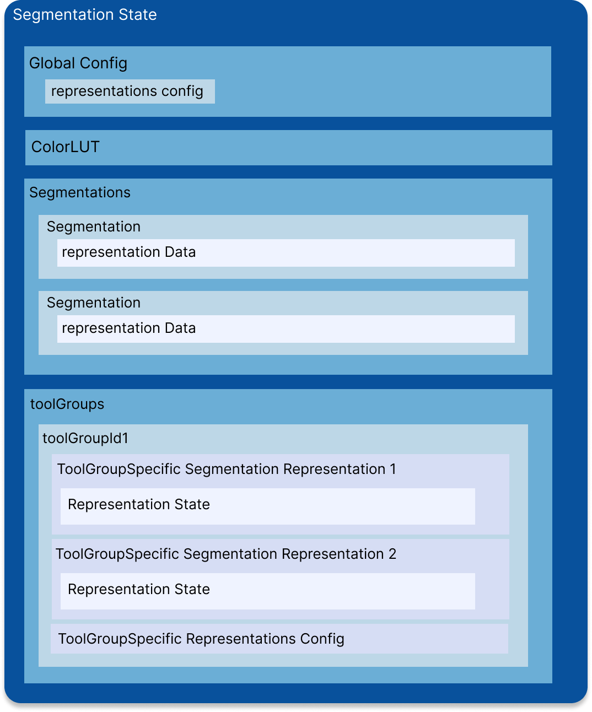

# State

`SegmentationState` stores all the information regarding the current state of the `Segmentation`s
and `SegmentationRepresentation`s in the library. As mentioned in the previous section
we have decoupled the `Segmentation`s and `SegmentationRepresentation`s from each other.
From a `Segmentation` various representations can be created (labelmap supported currently).
Therefore, the state also stores segmentations and their toolGroup-specific representations separately.

An overview of the state is shown below.

## Global Config

`Cornerstone3DTools` implements two configurations, and the consumer
can set each of them individually. `GlobalConfig` in the state
stores the global configuration for all segmenation representations in all toolGroups.

You can read more in the [`config`](./config.md) on how to set each individually.

## ColorLUT

## Segmentations

## ToolGroups
