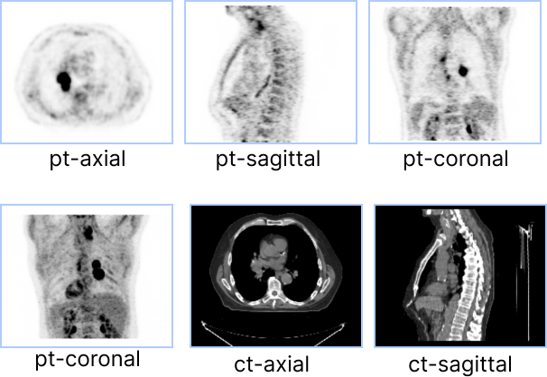

## Introduction

As discussed in the [`Tools`](./tools.md) section, in order to use a Tool you should
fist add the tool via `CornerstoneTools3D.addTool()` AND then add and set them active on viewports via `Tool Groups`.

Tool Groups are a new concept in the `Cornerstone` libraries. The goal of `ToolGroup` is to define
a simple way to define tool behavior in a per viewport/per tool fashion. In addition, via a common `ToolGroup`
viewports can share the same configuration, modes and tools.

Consider the following set of viewports, and the desired behavior for scrolling and panning.

<div style={{textAlign: 'center'}}>



</div>

For `ct-axial` and `ct-sagittal` viewports, we want to enable scrolling by mouse wheel and panning by mouse middle button drag.
However, for the `pt-coronal` which is a Maximum Intensity Projection (MIP) viewport, scrolling through slices
has no meaning, and desired behavior is to rotate the MIP volume by mouse wheel and disable panning.

<div style={{textAlign: 'center'}}>


</div>

:::note Important
There is a one-to-one relationship between viewports and tool groups. In other words, no viewport can be part of more than one tool group.
:::

## ToolGroup Creation and Tool Addition

`ToolGroups` are managed by a `ToolGroupManager`. Tool Group Managers are used to create, search for, and
destroy Tool Groups.

> Currently ToolGroups are not optional, and in order to use a tool you should create a toolGroup and add it to the toolGroup.

ToolGroupManager can be utilized to create a tool group using `createToolGroup`.

```js
import { ToolGroupManager } from '@cornerstonejs/tools';

const toolGroupId = 'ctToolGroup';
const ctToolGroup = ToolGroupManager.createToolGroup(toolGroupId);

// Add tools to ToolGroup
// Manipulation tools
ctToolGroup.addTool(PanTool.toolName);
ctToolGroup.addTool(ZoomTool.toolName);
ctToolGroup.addTool(ProbeTool.toolName);
```

### Adding Viewports to ToolGroups

Viewports should be added to the `ToolGroup` using `addViewport`.

```js
// Apply tool group to viewport or all viewports rendering a scene
ctToolGroup.addViewport(viewportId, renderingEngineId);
```

<details>
<summary>
Why we need to pass `renderingEngineId`?
</summary>

The reason is `viewportId`s are unique to a rendering engine. You can have multiple rendering engines that
include different viewports with the same `viewportId`.

</details>

### Activating a Tool

You can use `setToolActive` for each toolGroup to activate a tool providing a corresponding mouse bindings key.

```js
// Set the ToolGroup's ToolMode for each tool
// Possible modes include: 'Active', 'Passive', 'Enabled', 'Disabled'
ctToolGroup.setToolActive(LengthTool.toolName, {
  bindings: [{ mouseButton: MouseBindings.Primary }],
});
ctToolGroup.setToolActive(PanTool.toolName, {
  bindings: [{ mouseButton: MouseBindings.Auxiliary }],
});
ctToolGroup.setToolActive(ZoomTool.toolName, {
  bindings: [{ mouseButton: MouseBindings.Secondary }],
});
ctToolGroup.setToolActive(StackScrollMouseWheelTool.toolName);
```

Other Tool modes can also be set using `setToolEnabled`, `setToolPassive`, and `setToolDisabled`.

## ToolGroup Manager

Other methods for managing ToolGroups are available via `ToolGroupManager`.

### `getToolGroupForViewport`

returns the ToolGroup for a given viewport, read more [here](/api/tools/namespace/ToolGroupManager#getToolGroupForViewport)

### `getToolGroup`

returns the ToolGroup for a given toolGroupId

### `destroyToolGroup`

destroys a ToolGroup
