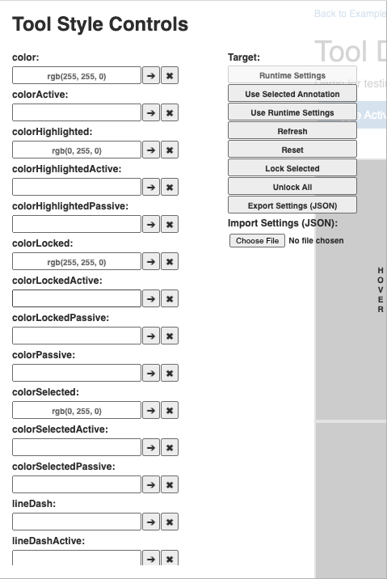

In this section we will explain various ways you can change the tool styles. This
includes various properties such as color when selected, highlighted, or locked;
textbox color, line dash style and thickness and more.

## Default Setting
CornerstoneTools 3D comes with a default settings for tools styles that can be found here `packages/cornerstone-tools/src/stateManagement/annotationStyle.ts`

```js
{
  "tool": {
    "style": {
      "color": "rgb(255, 255, 0)",
      "colorHighlighted": "rgb(0, 255, 0)",
      "colorSelected": "rgb(0, 255, 0)",
      "colorLocked": "rgb(255, 255, 0)",
      "lineWidth": "1",
      "lineDash": "",
      "textBox": {
        "fontFamily": "Helvetica Neue, Helvetica, Arial, sans-serif",
        "fontSize": "14px",
        "color": "rgb(255, 255, 0)",
        "colorHighlighted": "rgb(0, 255, 0)",
        "colorSelected": "rgb(0, 255, 0)",
        "colorLocked": "rgb(255, 255, 0)",
        "background": "",
        "link": {
          "lineWidth": "1",
          "lineDash": "2,3"
        }
      }
    }
  }
}
```

However, you can adjust each of the above parameters along with other styles that we will discuss next.

## Runtime settings vs Object settings
There are two settings that can be applied to style tools.

- **Runtime settings**: gets applied on ALL tools and can be accessed via
- **Object settings**: gets applied on the tool (object) and can be obtained via


### Hierarchical settings
It should be noted settings are hierarchical:

`DefaultSettings <- RuntimeSettings <- ObjectSettings`

This means that if there is a object-specific settings, csTools3D
will use that, if not, it will take a look inside `RuntimeSettings` and finally `DefaultSettings` will get applied.


## Global Tool Styles

```js
import { Settings } from '@ohif/cornerstone-render'

// 1. Getting runtimeSettings for all tools
const settings = Settings.getRuntimeSettings()

// 2. Changing the active color of tools
settings.set("tool.style.colorActive", "blue")
// settings.set("tool.style.colorActive", "rgb(0, 0, 255)")
```

## Tool-specific style

```js
import { Settings } from '@ohif/cornerstone-render'

1. Getting the annotation to be used to locate the tool settings

// 2. Getting objectSettings for the desired tools
const settings = Settings.getObjectSettings()

// 3. Changing the active color of the tool
settings.set("tool.style.colorActive", "blue")
// settings.set("tool.style.colorActive", "rgb(0, 0, 255)")
```


The list of all available tool styles with their default values are shown below:

```js
tool.style.color: "rgb(255, 255, 0)"
tool.style.colorActive
tool.style.colorHighlighted: "rgb(0, 255, 0)"
tool.style.colorHighlightedActive
tool.style.colorHighlightedPassive
tool.style.colorLocked: "rgb(255, 255, 0)"
tool.style.colorLockedActive
tool.style.colorLockedPassive
tool.style.colorPassive
tool.style.colorSelected: "rgb(0, 255, 0)"
tool.style.colorSelectedActive
tool.style.colorSelectedPassive
tool.style.lineDash: ""
tool.style.lineDashActive
tool.style.lineDashHighlighted
tool.style.lineDashHighlightedActive
tool.style.lineDashHighlightedPassive
tool.style.lineDashLocked
tool.style.lineDashLockedActive
tool.style.lineDashLockedPassive
tool.style.lineDashPassive
tool.style.lineDashSelected
tool.style.lineDashSelectedActive
tool.style.lineDashSelectedPassive
tool.style.lineWidth: "1"
tool.style.lineWidthActive
tool.style.lineWidthHighlighted
tool.style.lineWidthHighlightedActive
tool.style.lineWidthHighlightedPassive
tool.style.lineWidthLocked
tool.style.lineWidthLockedActive
tool.style.lineWidthLockedPassive
tool.style.lineWidthPassive
tool.style.lineWidthSelected
tool.style.lineWidthSelectedActive
tool.style.lineWidthSelectedPassive
tool.style.textBox.background: ""
tool.style.textBox.backgroundActive
tool.style.textBox.backgroundHighlighted
tool.style.textBox.backgroundHighlightedActive
tool.style.textBox.backgroundHighlightedPassive
tool.style.textBox.backgroundLocked
tool.style.textBox.backgroundLockedActive
tool.style.textBox.backgroundLockedPassive
tool.style.textBox.backgroundPassive
tool.style.textBox.backgroundSelected
tool.style.textBox.backgroundSelectedActive
tool.style.textBox.backgroundSelectedPassive
tool.style.textBox.color: "rgb(255, 255, 0)"
tool.style.textBox.colorActive
tool.style.textBox.colorHighlighted: "rgb(0, 255, 0)"
tool.style.textBox.colorHighlightedActive
tool.style.textBox.colorHighlightedPassive
tool.style.textBox.colorLocked: "rgb(255, 255, 0)"
tool.style.textBox.colorLockedActive
tool.style.textBox.colorLockedPassive
tool.style.textBox.colorPassive
tool.style.textBox.colorSelected: "rgb(0, 255, 0)"
tool.style.textBox.colorSelectedActive
tool.style.textBox.colorSelectedPassive
tool.style.textBox.fontFamily: "Helvetica Neue, Helvetica, Arial, sans-serif"
tool.style.textBox.fontFamilyActive
tool.style.textBox.fontFamilyHighlighted
tool.style.textBox.fontFamilyHighlightedActive
tool.style.textBox.fontFamilyHighlightedPassive
tool.style.textBox.fontFamilyLocked
tool.style.textBox.fontFamilyLockedActive
tool.style.textBox.fontFamilyLockedPassive
tool.style.textBox.fontFamilyPassive
tool.style.textBox.fontFamilySelected
tool.style.textBox.fontFamilySelectedActive
tool.style.textBox.fontFamilySelectedPassive
tool.style.textBox.fontSize: "14px"
tool.style.textBox.fontSizeActive
tool.style.textBox.fontSizeHighlighted
tool.style.textBox.fontSizeHighlightedActive
tool.style.textBox.fontSizeHighlightedPassive
tool.style.textBox.fontSizeLocked
tool.style.textBox.fontSizeLockedActive
tool.style.textBox.fontSizeLockedPassive
tool.style.textBox.fontSizePassive
tool.style.textBox.fontSizeSelected
tool.style.textBox.fontSizeSelectedActive
tool.style.textBox.fontSizeSelectedPassive
tool.style.textBox.link.lineDash: "2,3"
tool.style.textBox.link.lineDashActive
tool.style.textBox.link.lineDashHighlighted
tool.style.textBox.link.lineDashHighlightedActive
tool.style.textBox.link.lineDashHighlightedPassive
tool.style.textBox.link.lineDashLocked
tool.style.textBox.link.lineDashLockedActive
tool.style.textBox.link.lineDashLockedPassive
tool.style.textBox.link.lineDashPassive
tool.style.textBox.link.lineDashSelected
tool.style.textBox.link.lineDashSelectedActive
tool.style.textBox.link.lineDashSelectedPassive
tool.style.textBox.link.lineWidth: "1"
tool.style.textBox.link.lineWidthActive
tool.style.textBox.link.lineWidthHighlighted
tool.style.textBox.link.lineWidthHighlightedActive
tool.style.textBox.link.lineWidthHighlightedPassive
tool.style.textBox.link.lineWidthLocked
tool.style.textBox.link.lineWidthLockedActive
tool.style.textBox.link.lineWidthLockedPassive
tool.style.textBox.link.lineWidthPassive
tool.style.textBox.link.lineWidthSelected
tool.style.textBox.link.lineWidthSelectedActive
tool.style.textBox.link.lineWidthSelectedPassive
```


## Example Demo page
You can open "Tool Display Configuration Example" in the demos to play with each of the settings.
If you hover on the left side of the page the following control panel will appear that
shows various configurations in effect. The source code for this demo
can be found in `packages/demo/src/ExampleToolDisplayConfiguration.tsx`.


