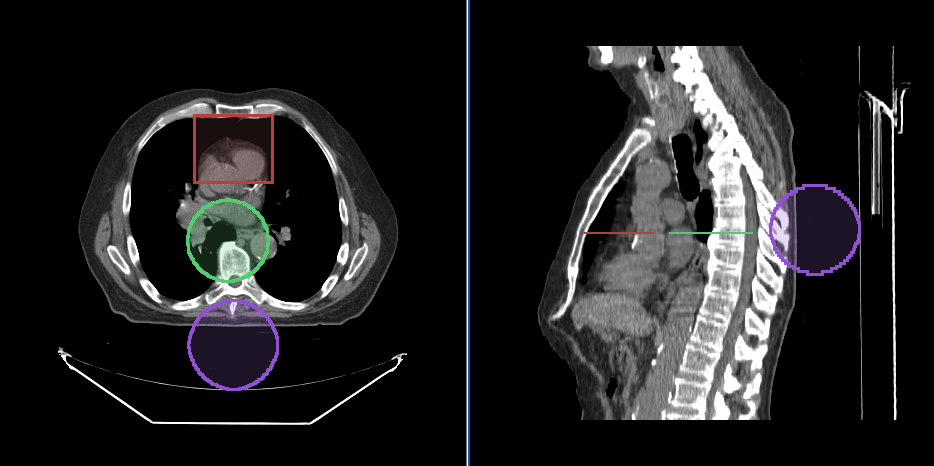

## Introduction

A tool is an uninstantiated class that implements at least the `BaseTool` interface.
Tools can be configured via their constructor. To use a tool, one must:

- Add the uninstantiated tool using the library's top level `addTool` function
- Add that same tool, by name, to a ToolGroup

Here we will introduce several concepts about tools (annotation and segmentation tools)
inside `Cornerstone3DTools`.

## Tools

### Manipulation Tools

`Cornerstone3DTools` provides a set of tools that can be used to manipulate the
images in the viewports. These include:

- enabling zooming in and out of the image (`ZoomTool`)
- performing panning and navigation of the image (`PanTool`)
- scrolling through the image (`StackScrollMouseWheelTool`)
- manipulating the windowLevel of the image (`WindowLevelTool`)

### Annotation Tools

`Cornerstone3DTools` provide a set of annotation tools. You can use these tools
to create and edit annotations for use cases such as:

- Measuring distance between two points (Length Tool)
- Measuring height between two points (Height Tool)
- Measuring width and length for a structure (Bidirectional Tool)
- Measuring area and statistics for a rectangular area (RectangleRoi Tool)
- Measuring volume and statistics for a ellipsoid (EllipseRoi Tool)
- Getting the underlying value for a voxel (Probe Tool)

Below, you can see a screenshot of the annotation tools that are available in `Cornerstone3DTools`.

<div style={{textAlign: 'center'}}>


</div>

### Dynamic tool statistics

`Cornerstone3DTools` is capable of calculating dynamic statistics based on the modality of the volume being rendered. For instance, for CT volumes a `ProbeTool` will give Hounsfield Units and for PET it will calculate SUV stats.

<div style={{textAlign: 'center', width:'85%'}}>


</div>

### Annotation sharing in Frame of Reference

Since, annotations are stored in the patient physical space, if there are
two viewports that are displaying the same frame of reference, they will share
the same annotations.

### Segmentation Tools

`Cornerstone3D` also provides segmentation tools. This includes3D segmentation editing tools such as brush, rectangle and circle scissors, and
3d sphere tools.

We will discuss in length the different types of segmentation tools and how they
are used in `Cornerstone3DTools` in [`Segmentation`](./segmentation/index.md) section.

<details>

<summary>How tools work internally</summary>

mouse and keyboard fire events, these events are captured and normalized by
`Cornerstone3DTools`. The normalized events are then fired and handled by
tools either as `mouseDown`, `mouseDrag` and `mouseUp` events.

</details>

<div style={{textAlign: 'center', width:'85%'}}>



</div>

## Adding Tools

The `Cornerstone3DTools` library comes packaged with several common tools. All implement either
the `BaseTool` or `AnnotationTool`. In order to be able to use the tools, you must
first add them to the `Cornerstone3DTools`. You can do this by using the `addTool` function.

```js
import * as csTools3d from '@cornerstonejs/tools';

const { PanTool, ProbeTool, ZoomTool, LengthTool } = csTools3d;

csTools3d.addTool(PanTool);
csTools3d.addTool(ZoomTool);
csTools3d.addTool(LengthTool);
csTools3d.addTool(ProbeTool);
```

:::note warning
Adding a tool to the library will only let the library know about the tool.
It will not automatically add the tool to any tool groups, nor will it
instantiate the tool for usage.

:::

## Tool Modes

Tools (in their toolGroup) can be in one of four modes. Each mode impacts how the tool responds to
interactions.

> There should never be two active tools with the same binding

<table>
  <tr>
    <td>Tool Mode</td>
    <td>Description</td>
  </tr>
  <tr>
    <td>Active</td>
    <td>
      <ul>
        <li>Tools with active bindings will respond to interactions</li>
        <li>If the tool is an annotation tool, click events not over existing annotations
  will create a new annotation.</li>
      </ul>
    </td>
  </tr>
  <tr>
    <td>Passive (default)</td>
    <td>
      <ul>
        <li>If the tool is an annotation tool, if it's handle or line is selected, it
    can be moved and repositioned.</li>
      </ul>
    </td>
  </tr>
  <tr>
    <td>Enabled</td>
    <td>
      <ul>
        <li>The tool will render, but cannot be interacted with.</li>
      </ul>
    </td>
  </tr>
  <tr>
    <td>Disabled</td>
    <td>
      <ul>
        <li>The tool will not render. No interaction is possible.</li>
      </ul>
    </td>
  </tr>
</table>
