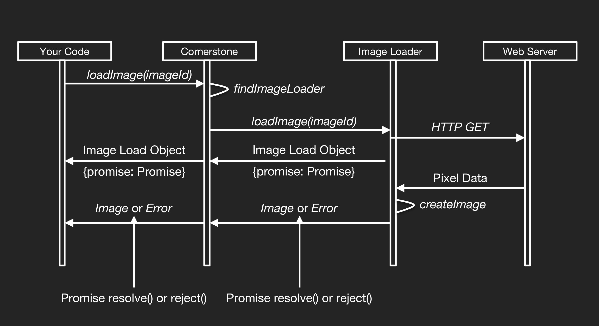

# Image Loaders

An Image Loader is a JavaScript function that is responsible for taking an Image Id for an Image and returning the corresponding Image Load Object for that Image to Cornerstone. The Image Load Object contains a Promise which resolves to produce an Image.

Since loading images usually requires a call to a server, the API for image loading needs to be asynchronous. Cornerstone requires that Image Loaders return an Object containing a Promise which Cornerstone will use to receive the Image Object asynchronously, or an Error if one has occurred.

## Image Loader Workflow

1. ImageLoaders register themselves with cornerstone to load specific ImageId URL schemes
2. The application requests to load an image using the `setStack` or `setVolumes` api.
3. Cornerstone delegates the request to load the image to the ImageLoader registered with the URL scheme of the imageId.
4. The ImageLoader will return an `Image Load Object` containing a Promise which it will resolve with the corresponding Image Object once it has obtained the pixel data. Obtaining the pixel data may may require a call to a remote server using `XMLHttpRequest`, decompression of the pixel data (e.g. from JPEG 2000), and conversion of the pixel data into the format that Cornerstone understands (e.g. RGB vs YBR color).
5. The [Image Object](./images.md) passed back by the resolved Promise is then displayed using `renderingEngine` API.

## Register Image Loader

You can use [`registerImageLoader`](/docs/cornerstone-render/#registerimageloader) to make an external image loader available to the
cornerstone library. This function accept a `scheme` which the image loader function (second argument) should act on. Take a look into [`CornerstoneWADOImageLoader`](https://github.com/cornerstonejs/cornerstoneWADOImageLoader) which is designed to communicate via WADO protocol.
