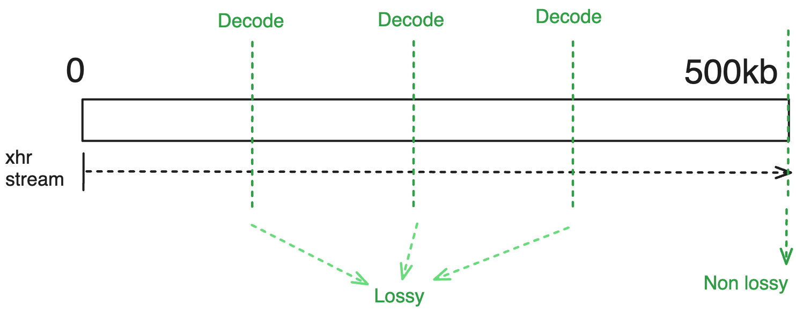
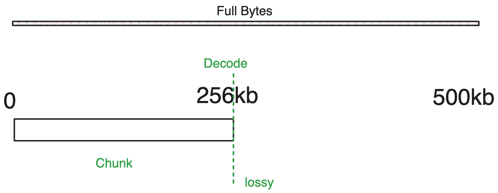
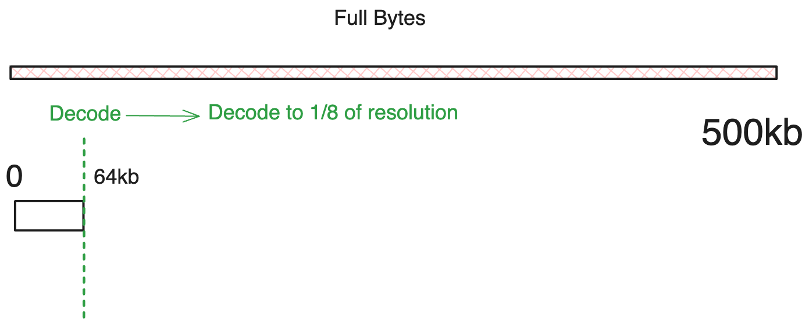

# Retrieve Configuration

Progressive loading works in steps called `stages`. Each stage is part of **which images load with which settings**, and you can set each stage with different settings, known as `retrieve options`. Together (stages and options) make up the `retrieve configuration`, which manages how images are loaded step by step. Let's dive in.

```ts
interface IRetrieveConfiguration {
  stages: RetrieveStage[];
  retrieveOptions: Record<string, RetrieveOptions>;
}
```

## Retrieve Stages

As the name of progressive loading suggests, the loading process is done in
`stages`. Each `stage` can be configured to use a different retrieve method (streaming or byteRange) and its common or specific retrieve options.

:::info
Since you can have multiple stages, the two methods (streaming and byte range) can be combined and utilized at different stages.

For instance you can create a configuration that

1.  start **streaming** of specific initial slices (typically the first, middle, or last slice) for immediate viewing.
2.  Subsequently, in the second stage, **byte range requests** (only couple of `kb`) can be made for the rest of the slices to efficiently render the complete volume as quickly as possible (even if lossy).
3.  Finally, you perform supplementary **byte range requests** for the remaining segments that have not yet been requested, following the initial byte range request in step 2.

This approach is actually employed in the volume loading process, which will be further elaborated upon in our subsequent discussion.
:::

So, in summary, the Retrieve Stage is a configuration that specifies which images load with which settings. For the simplicity of this document and to not lose focus, we will only talk about the `retrieveType`, which is just a reference to the retrieve options. We will discuss more advanced options, such as selecting images for strategy, prioritizing, and queuing loading, later.


<!--  -->

As seen above, the retrieve stages can be as simple a list of objects, each with an `id`
and a `retrieveType` (which is a reference to the retrieve options which we will talk next).

:::tip
The `retrieveType` is an optional string that is only used for referencing the option to be used. You can use any string as long as you are consistent in using it in the retrieve options **as well**. Use `'lkajsdflkjaslfkjsadlkfj'` if you wish (but then you should have an object
with key of `'lkajsdflkjaslfkjsadlkfj'` in the `retrieveOptions` object as we will see below).
:::

<details>
<summary>
What would happen if we reference a retrieve type that is not defined in the retrieve options?
</summary>

Cornerstone will check if a `default` retrieve options is specified, if true, it will use that otherwise will ignore the progressive loading configuration and will load the image as if progressive loading is not enabled (like before)

</details>

## Retrieve Options

Now we an talk about retrieve options for each of the methods (streaming or byte range) in more detail. Let's dive into the common options first.

### Common Options

There are more advanced options for the retrieval configuration that can be used to handle more use cases. We will talk about them later in another section.

#### Decode Level (quality)

One natural question that might arise is, regardless of the method (stream or byte range) how often the image is decoded and when we decode what is the resolution of the image that we should decode to?

The resolution of decoding is controlled by `decodeLevel` configuration and it can be

- 0 = full resolution
- 1 = half resolution
- 2 = quarter resolution
- 3 = eighth resolution
- ...

So if the decodeLevel for a stage is set to 0, then the image will be decoded to full resolution. If it is set to 1, then the image will be decoded to half resolution (x/2, y/2) and so on.

:::tip
For volume viewports, we currently don't allow decoding into sub-resolution because it would require reallocating the volume in memory, which is inefficient. Therefore, if the data is partial and can't be decoded into full resolution, we simply replicate it (inside a web worker for performance) to fill the entire volume.

However, for the stack viewport, we do allow decoding into sub-resolution since this re-allocation is cheaper than the whole volume. Additionally, in this scneario, future enhanced qualities of the image will wipe out the old image and create a new image with new size until full resolution is reached.
:::

We will talk about `frequency` in the each method's section below.

### Streaming Options

#### Options

For streaming requests, you can configure the following options:

- `streaming`: whether to use streaming or not

#### Decoding Frequency

Most often, when the stream is coming from a server, the server lets the client know about the final size of the data. So, at each point in time, we can identify the percentage of the data that has been downloaded and decode the image to the relevant resolution so in the streaming scenario you really don't have to set it manually.

Different levels are, if the downloaded portion at the time of decoding is

- \< 8 \% of the total data, then decode to level 3
- 8 \< x \< 13 \% of the total data, then decode to level 2
- 13 \< x \< 27 \% of the total data, then decode to level 1
- \< 100 (means it is not finished) then decode to level 0
- 100 \% of the total data (stream is finished), then decode to level 0

:::tip
How did we come up with these levels? It is kind of simple.

For instance, if we have only downloaded 1/16th of the total data, it means we have downloaded 6.25% of the data (8% is 6.25% with some offset). This means we can decode the image to 1/16th of the original size, which is level 4. However, the interpolation provided by the decoder is slightly better than that provided by straight image rendering, and thus one can decode to a slightly lower level, using level 3 instead.
The same goes for the rest of the levels.
:::

To answer the question of how many decoding levels will occur, it totally depends on the initial data that is downloaded and how the stream progresses. But at any given time when the data is downloaded, we check the progress against the above levels and decode the image to the relevant resolution if possible. If an error is thrown or the image is not decoded, we simply wait for the next progress event to occur.

#### Example

For the simple streaming scenario (streaming true) you should expect the following behavior:



#### Use cases

using the streaming method is suitable for the scenarios that you eventually
require the full resolution of the data and you want to start viewing the data
as soon as possible.

### Byte Range Options

#### Options

- `chunkSize`: byte range value to retrieve for initial decode (default is 64kb).
  Ignored for all but the first range request (regardless of rangeIndex).
- `rangeIndex`: is the range number (index) that you want to fetch, -1 for remaining data

Note that there is no guarantee that the rangeIndex will actually fetch another
range since it will discontinue fetching once all the data has been fetched.
Also, -1 is used to flag the "remaining" data.

#### Decoding Frequency

There are two scenarios for byte range requests:

- If the server sends back the total size of the data in the header of the response for the byte range in which we use our automatic
  decoding frequency (similar to the streaming scenario).
- The server does not send back the total size of the data in the header of the response for the byte range in which we wait until the range request is finished and then decode the image.

:::tip
The server should send the cors header `Access-Control-Expose-Headers: *` to
enable reading the `Range-Response` header required for seeing the total size.
Otherwise, the range request is finished when the multipart/related header
is complete OR the returned data is smaller than the requested data.
:::

#### Example

For instance for the options of

```js
{
  rangeIndex: 0,
  chunkSize: 256000, // 256kb
}
```



another example

```js
{
  rangeIndex: 0,
  decodeLevel: 3
}

// chunkSize is default 64kb
```



:::tip
You can fetch the remaining data by using `rangeIndex: -1`.
In addition, `rangeIndex = 0` will always be the first chunk.

For instance, if you have 4 ranges, then your ranges would be

- `rangeIndex 0`: `0` to `chunkSize-1` (in bytes)
- `rangeIndex 5`: `chunkSize` to `5 * chunkSize-1` (in bytes)
- `rangeIndex 25`: `5 * chunkSize` to `25 * chunkSize-1` (in bytes)
- `rangeIndex -1`: `25 * chunkSize` to `totalSize` (in bytes) - the rest of the data

This use of rangeIndex allows retrieving larger increments to agree with the
amount of data required for decodeLevel values.
:::

<details>
<summary>
What if I start with a range 1 instead of 0?
</summary>

Cornerstone will automatically fetch the range 0 combined with range 1 as a single request.
This avoids needing to perform multiple intermediate requests.

</details>

#### Use cases

Other than we can use the range request to progressively request and load a better quality
images there are some other usecases

- Thumbnails: Often, for thumbnails, we want to load the image as quickly as possible but don't need the full resolution. We can use a byte range request to fetch a lower resolution version of the data.
- CINE: For certain imaging needs, the frame rate is absolutely essential in the cine mode. Often, the gross anatomy is desired in these scenarios, not the details, but the frame rate is of greater importance. We can use the byte range request to fetch the subresolution of the data, guaranteeing that we can achieve the target frame rate.

In the future, a separate memory cache might be used for range request details,
but right now the intermediate data is held alongside the image data. Storing
it in a cache would allow for CINE display with only the cost of decoding the image.

## Conclusion

So, we learned that a "retrieve configuration" is composed of at least one (can be more) "retrieve stage" and an accompanying "retrieve options" that have the keys referenced in the "retrieve stages." We also learned that each "retrieve stage" can be configured to use a different method (streaming or byte range) and has common or specific retrieve options.

Let's look at an example of one of the examples that we have in the stackProgressive demo

```js
const retrieveConfiguration = {
  stages: [
    {
      id: 'initialImages',
      retrieveType: 'single',
    },
  ],
  retrieveOptions: {
    single: {
      streaming: true,
    },
  },
};
```

:::tip
Note the common use of 'single' in both the `stages` and `retrieveOptions` objects. This is just a reference to the retrieve options that we have defined in the `retrieveOptions` object.
:::

Now your question might be, how do we [use this configuration](./usage)? We will talk about that in the next section. But curious readers can move to the advanced configuration section to learn more about the advanced options that we have for the retrieve configuration.
