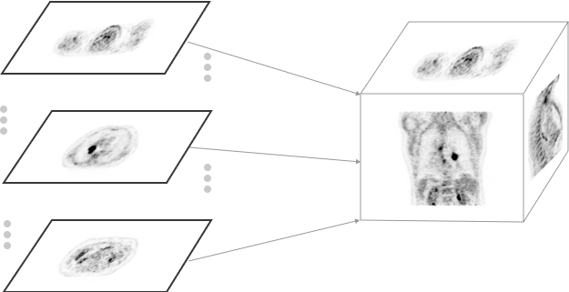

# Streaming of Volume data

With the addition of [`Volumes`](../cornerstone-core/volumes.md) to `Cornerstone3D`, we are adding and maintaining `Streaming-volume-image-loader`
which is a progressive loader for volumes. This loader is designed to accept imageIds and
load them into a `Volume`.

## Creating Volumes From Images

Since 3D `Volume` is composed of 2D images (in `StreamingImageVolume`), its volume metadata is derived from the metadata of the 2D images.
Therefore, an initial call to fetch images metadata is required for this loader. This way,
not only we can pre-allocate and cache a `Volume` in memory, but we also can render the volume
as the 2D images are being loaded (progressive loading).

<div style={{textAlign: 'center'}}>



</div>

By pre-fetching the metadata from all images (`imageIds`), we don't need to create
the [`Image`](../cornerstone-core/images.md) object for each imageId. Instead, we can
just insert the pixelData of the image is directly inserted into the volume
at the correct location. This guarantees speed and memory efficiency (but comes
at minimal cost of pre-fetching the metadata).

## Converting volumes from/to images

`StreamingImageVolume` loads a volume based on a series of fetched images (2D), a `Volume` can implement functions to convert its 3D pixel data to 2D images without re-requesting them over the network. For instance, using `convertToCornerstoneImage`, `StreamingImageVolume` instance takes an imageId and its imageId index and return a Cornerstone Image object (ImageId Index is required since we want to locate the imageId pixelData in the 3D array and copy it over the Cornerstone Image).

This is a process that can be reverted; `Cornerstone3D` can create a volume from a set of `imageIds` if they have properties of a volume (Same FromOfReference, origin, dimension, direction and pixelSpacing).

## Usage

As mentioned before, a pre-cache volume should be created before hand from the image metadata. This can be
done by calling the `createAndCacheVolume`.

```js
const ctVolumeId = 'cornerstoneStreamingImageVolume:CT_VOLUME';
const ctVolume = await volumeLoader.createAndCacheVolume(ctVolumeId, {
  imageIds: ctImageIds,
});
```

Then the volume can call its `load` method to actually load the pixel data of the images.

```js
await ctVolume.load();
```

## imageLoader

Since the volume loader does not need to create the [`Image`](../cornerstone-core/images.md) object for each imageId in
the `StreamingImageVolume`, it will use the `skipCreateImage` option internally to skip the creation of the image object.
Otherwise, the volume's image loader is the same as wadors image loader written in `cornerstone-wado-image-loader`.


```js
// using sharedArrayBufferImageLoader to load the images
const imageIds = ['wadors:imageId1', 'wadors:imageId2'];

const ctVolumeId = 'cornerstoneStreamingImageVolume:CT_VOLUME';

const ctVolume = await volumeLoader.createAndCacheVolume(ctVolumeId, {
  imageIds: ctImageIds,
});

await ctVolume.load();
```

## Alternative implementations to consider

Although we believe our pre-fetching method for volumes ensures that the volume is loaded as fast as possible,
There can be other implementations of volume loaders that don't rely on this prefetching.

#### Creating Volumes without pre-fetching metadata

In this scenario, each image needs to be created separately, which means each image needs to be loaded and a
Cornerstone [`Image`](../cornerstone-core/images.md) should be created. This is a costly operation as all the image
objects are loaded in memory and a separate creation of a [`Volume`](../cornerstone-core/volumes.md) is required from
those images.

Advantages:

- Not need for a separate metadata call to fetch the image metadata.

Disadvantages:

- Performance cost
- Cannot progressively load the image data, as it requires creating a new volume for each image change
