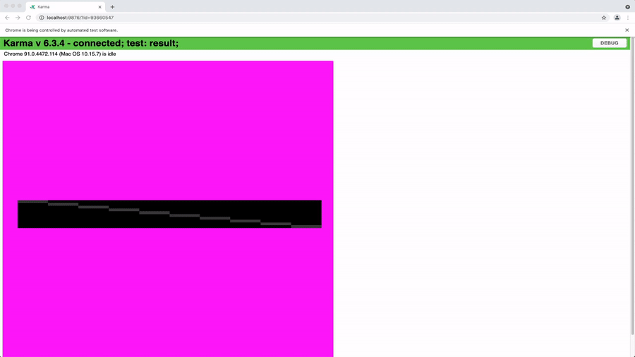

# Writing Karma Tests

To make sure our rendering and tools don't break upon future modifications, we have
written tests for them. Rendering tests includes comparing the rendered images
with the expected images. Tools tests includes comparing the output of the tools
with the expected output.

### Running Karma Tests Locally

You can run `yarn run test` to run all tests locally.
By default, `karma.conf.js` will run the tests in a headless chrome browser to make
sure our tests can run in any servers. Therefore, you cannot visualize it by default. In order
to run the tests and visually inspect the results, you can run the tests by changing the
`karma.conf.js` file to have `browsers: ['Chrome']` instead of `browsers: ['ChromeHeadless']`.



### Generating HTML Review Reports

For local review, use the repository wrapper instead of reading terminal output only:

```bash
./scripts/run-karma.sh
./scripts/run-karma.sh --compat
./scripts/run-karma.sh --cpu
./scripts/run-karma.sh --next
```

The wrapper runs `npx karma start --single-run`, captures the log, and generates timestamped output under `reports/`.

Examples:

```bash
reports/legacy-karma/<timestamp>/legacy-karma.log
reports/legacy-karma-<timestamp>/index.html
reports/compat-karma/<timestamp>/compat-karma.log
reports/compat-cpu-karma/<timestamp>/compat-cpu-karma.log
```

Supported wrapper flags:

- `--compat`: force compatibility mode for the Karma run.
- `--cpu`: force CPU rendering for the Karma run.
- `--next`: convenience mode that runs two passes, `--compat` and then `--compat --cpu`.

Any other arguments are passed directly to `karma start`, so you can keep using normal Karma CLI options:

```bash
./scripts/run-karma.sh --browsers Chrome --no-single-run
./scripts/run-karma.sh --reporters spec
```

Useful environment variables:

- `KARMA_GREP="<pattern>"`: filter tests via Karma client args.
- `KARMA_PACKAGE=core|tools`: load only the selected package's Karma tests.
- `FORCE_COMPAT=true` and `FORCE_CPU_RENDERING=true`: direct overrides when running `karma start` without the wrapper.

Examples:

```bash
./scripts/run-karma.sh
./scripts/run-karma.sh --compat
./scripts/run-karma.sh --compat --browsers Chrome --no-single-run
KARMA_GREP="flip a stack viewport vertically" ./scripts/run-karma.sh --browsers Chrome --no-single-run
KARMA_PACKAGE=core ./scripts/run-karma.sh
```

### Reviewing Image Comparisons

When Karma tests use `compareImages()`, the HTML report includes persisted image artifacts for review.
This now applies to passing and failing image comparisons, not only failures.

For each comparison artifact, the report shows:

- `Expected`
- `Actual`
- `Compare`
- `Diff Mask`

The `Compare` panel overlays expected and actual with a slider, and each tile includes direct open links
so you can inspect the raw generated images in a separate tab.

The HTML report also supports filtering by status, and failed tests are rendered first in the report.

### Running Only One Karma Test Locally

Use `KARMA_GREP` when you want to keep the wrapper but filter the suite:

```bash
KARMA_GREP="flip a stack viewport vertically" ./scripts/run-karma.sh
KARMA_GREP="flip a stack viewport vertically" ./scripts/run-karma.sh --browsers Chrome --no-single-run
```

For ad hoc debugging, you can also still use Jasmine helpers such as `fdescribe` and `fit`.
