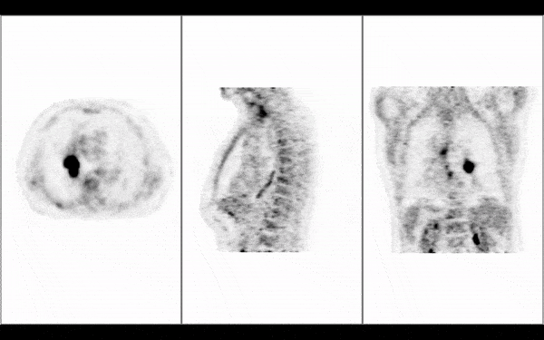

import Link from '@docusaurus/Link';

# Overview

`Cornerstone3D` is a lightweight Javascript library for visualization of medical images in modern web browsers that support the HTML5 canvas element.
Using `@cornerstonejs/core` and its accompanying libraries such as `@cornerstonejs/tools`, you can achieve a wide range of imaging tasks.

 

<Link target={"_blank"} to="/live-examples/petCT.html">
    <button id="open-ptct-button">
        Open PT/CT Demo
    </button>
</Link>

 
 

<Link target={"_blank"} to="/live-examples/local.html">
    <button id="open-ptct-button">
        Open Local DICOM Demo
    </button>
</Link>

## Features

### Rendering

Using the new `Cornerstone3D` rendering engine and its Stack and Volume viewports, you can:

- Render all transfer syntaxes including various compressed formats such as JPEG2000, JPEG Lossless
- Stream the slices of a volume and view them in real-time as they are being loaded
- View the same volume in different orientations such as axial, sagittal, and coronal without having to re-load the entire volume again (minimum memory footprint)
- View oblique slices in a volume
- Render different blends of the same volume (e.g. MIP (maximum intensity projection) and average intensity projection)
- Fuse and overlay multiple images such as PET/CT fusion
- Render color images and render them as a volume
- Fall back to CPU rendering when GPU rendering is not available
- Change calibration of the images by modifying the metadata for the viewport (e.g. pixel spacing)

### Manipulation

`Cornerstone3DTools` enables the following features:

- Zoom in and out of the image using mouse bindings
- Pan the image in any direction
- Scroll through the image in any orientation even in oblique slices
- Change the window level of the image

### Annotation

`Cornerstone3DTools` also enables annotating images using tools. All annotations are
rendered as SVG elements which ensures that they are displayed at the best possible quality
in any monitor resolution. Annotations in `Cornerstone3DTools` are stored
in the actual physical space of the image which lets you render/modify the same annotations in multiple viewports.
In addition, you can:

- Activate certain tools on certain viewports with ToolGroups (e.g., on scroll activate slice scrolling on CT Axial viewport but volume rotation for PT MIP viewport)
- Measure distances between two points using the Length tool
- Measure length and width using bidirectional line tools
- Calculate statistics such as mean, standard deviation of a region of interest using Rectangle/Elliptical ROI Tool
- Use crosshairs to find corresponding points in images of different viewports and navigate slices using reference lines
- Assign different tools to be activated while holding a specific modifier key (e.g. shift, ctrl, alt)
- Create your own custom tools

### Segmentation

`Cornerstone3D` supports rendering segmentations of images as labelmaps in all viewports including stack, volume, and 3D.
You can:

- Render segmentations as labelmaps in the viewports (e.g. segmentation of CT lung)
- Convert the label maps to surfaces in the 3D viewport and apply the same color.
- View segmentations in any orientation (e.g. axial, sagittal, coronal) even in oblique slices
- Change labelmap configuration (e.g. color, opacity, outline rendering, outline thickness etc.)
- Edit/draw a segment in 3D Axial, Sagittal, Coronal using scissor tools such as Rectangle, Ellipse scissors
- Apply a certain threshold to a labelmap for the region of interest

### Synchronization

`Cornerstone3D` supports synchronization between multiple viewports. Currently, there
are two implemented synchronizers and we are working on more.

- WindowLevel synchronizer: synchronizes the window level of the source and target viewports
- Camera synchronizer: synchronizes the camera of the source and target viewports

## About this documentation

Our documentation can be broken down into the following sections:

- [**Getting Started**](/docs/category/getting-started): covers the scope of the project, related libraries and other relevant information, and installation instructions
- [**Tutorials**](/docs/category/tutorials): provides a series of tutorials for different tasks such as rendering, tools, segmentation
- [**How-to-Guides**](/docs/category/how-to-guides): provides guides for more advanced tasks such as custom loaders, custom metadata providers
- [**Concepts**](/docs/category/concepts): explains an in-depth look at various technical concepts that are used in the library
- [**Contributing**](/docs/category/contributing/): explains how to contribute to the project and how to report bugs
- [**Migration Guides**](/docs/migrationGuides): includes instructions for upgrading from legacy to new versions of the library, and also upgrading from 1.x to 2.x
- [**FAQ**](/docs/faq): provides answers to frequently asked questions
- [**Help**](/docs/help): provides information of how to get help with the library
- [**Test Coverage Report**](/test-coverage/): provides a detailed report of the test coverage of the library
- [**Examples**](/docs/examples): Displays the live examples of the library
- [**API Reference**](/api): provides a detailed description of the API and how to use each function

If a page is no longer up-to-date, you can author a PR to update it by modifying
the files in `/packages/docs/docs/*.md`. Read more on how to contribute [here](../contribute/pull-request.md).
