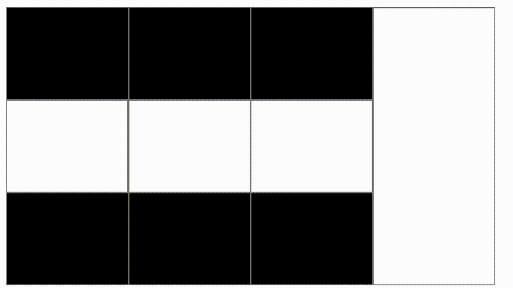

# Overview

`Cornerstone3D` is a lightweight Javascript library for visualization of medical images in modern web browsers that support the HTML5 canvas element.
Using `Cornerstone3D` and its accompanying libraries such as `cornerstone3DTools`, you can achieve a wide range of imaging applications:

## Features

### Rendering

Using the new `Cornerstone3D` renderingEngine and its Stack and Volume viewports, you can:

- render all transfer syntaxes including various compressed formats such as JPEG2000, JPEG Lossless
- stream the slices of a volume and view them in real-time
- view the same volume in different orientations such as axial, sagittal, and coronal without having to re-load the entire volume again (minimum memory footprint)
- view oblique slices in a volume
- render different blends of the same volume (e.g. MIP (maximum intensity projection) and Average (average intensity projection))
- fuse and overlay multiple images such as PET/CT fusion
- rendering color images and render them as a volume
- fall back to CPU rendering when GPU rendering is not available
- change calibration of the images by modifying the metadata for the viewport (e.g. pixel spacing)

### Manipulation

`cornerstone3DTools` enables the following features:

- zoom in and out of the image using mouse bindings
- panning the image in any direction
- scrolling through the image in any orientation even in oblique slices
- changing the window level of the image

### Annotation

`cornerstone3DTools` also enables annotating images using tools. All annotations are
rendered as SVG elements which ensures that they are displayed at the best possible quality
in any monitor resolution. Annotations in `cornerstone3DTools` are stored
in the actual physical space of the image which lets you render/modify the same annotations in multiple viewports.
In addition, you can:

- activate certain tools on certain viewports with ToolGroups (e.g., on scroll activate slice scrolling on CT Axial viewport but volume rotation for PT MIP viewport)
- measure distances between two points using the Length tool
- measure length and width using bidirectional line tools
- calculate statistics such as mean, standard deviation of a region of interest using Rectangle/Elliptical ROI Tool
- use crosshairs to find corresponding points in images of different viewports and navigate slices using reference lines
- assign different tools to be activated while holding a specific modifier key (e.g. shift, ctrl, alt)
- create your own custom tools

### Segmentation

`Cornerstone3D` supports rendering segmentations of images as labelmaps in the volume viewport.
You can:

- render segmentations as labelmaps in the volume viewport (e.g. segmentation of CT lung)
- view segmentations in any orientation (e.g. axial, sagittal, coronal) even in oblique slices
- change labelmap configuration (e.g. color, opacity, outline rendering, outline thickness etc.)
- edit/draw a segment in Axial, Sagittal, Coronal using scissor tools such as Rectangle, Ellipse scissors
- apply a certain threshold to a labelmap for the region of interest

### Synchronization

`Cornerstone3D` supports synchronization between multiple viewports. Currently, there
are two implemented synchronizers in `Cornerstone3D` and we are working on more.

- windowLevel synchronizer: synchronizes the window level of the source and target viewports
- camera synchronizer: synchronizes the camera of the source and target viewports

## About this documentation

Our documentation can be broken down into the following sections:

- [**Introduction**](/docs/category/introduction): covers scope of the project, related libraries and other relevant information
- **Getting Started**: includes installation instructions, basic usage and examples
- **How-to-Guides**: provides guides for common tasks such as loading images, rendering images, and annotating images
- **Concepts**: explains an in-depth look at various technical concepts that are used in the library
- **API Reference**: provides a detailed description of the API and how to use each function
- [**Contributing**](/docs/category/contributing/): explains how to contribute to the project and how to report bugs
- **Migration Guides**: includes instructions for upgrading from legacy `cornerstone-core` and `cornerstone-tools` to `Cornerstone3D` and `cornerstone3DTools`
- **Test Coverage Report**: provides a detailed report of the test coverage of the library
- **FAQ**: provides answers to frequently asked questions

If a page is no longer up-to-date, you can author a PR to update it by modifying
the files in `/packages/docs/docs/*.md`. Read more on how to contribute [here](../contribute/pull-request.md).
