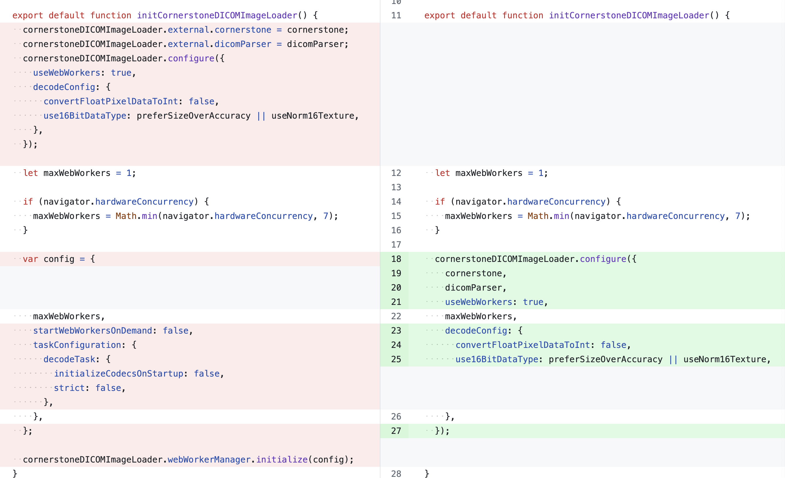

Here are the breaking changes from the cornerstone 1.x to 2.x.

## Typescript Upgrade

We have upgraded the typescript version from 4.6 to 5.4 in the 2.0 version of the cornerstone3D.
This upgrade most likely don't require any changes in your codebase, but it is recommended to update the typescript version in your project to 5.4
to avoid any issues in the future.

## DICOM Image Loader

### Decoders Update

`@cornerstonejs/dicomImageLoader` previously utilized the old API for web workers, which is now deprecated. It has transitioned to the new web worker API via the `comlink` package. This change enables more seamless interaction with web workers and facilitates compiling and bundling the web workers to match the ESM version of the library.

### Removing support for non-worker decoders

We have removed support for non-web worker decoders in the 2.0 version of the cornerstone3D. This change is to ensure that the library is more performant and to reduce the bundle size.

### DICOM Image Loader ESM default

We have changed the default export of the DICOM Image Loader to ESM in the 2.0 version of the cornerstone3D and correctly
publish types

### InitCornerstoneDICOMImageLoader

Previously vs now

## getDataInTime

The imageCoordinate is renamed to worldCoordinate in the 2.0 version of the cornerstone3D. As it
is the correct term and was misleading in the previous version.

## STACK_VIEWPORT_NEW_STACK now fires on the element

Similar to all other NEW events , New volume

## Rotation is removed from viewport properties

As it is not a property like other properties of the viewport, and is view related.
You can still get the rotation from .getRotation or better use `getViewPresentation`
which will give you the presentation of the viewport including pan, zoom, rotation and displayArea.
