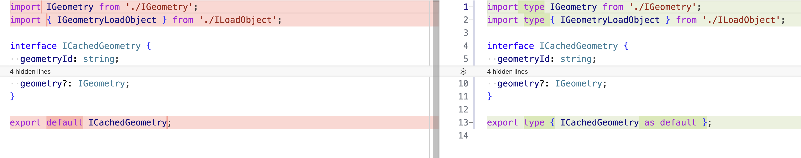

import Tabs from '@theme/Tabs';
import TabItem from '@theme/TabItem';

Here are the breaking changes from the cornerstone 1.x to 2.x.

At first glance, it may seem that many files have been changed, with almost all files affected. However, it's important to note that most changes involve fixing import types and removing dependency cycles. Let's examine these changes in more detail below.



We've addressed and documented all changes, but if you notice any undocumented modifications in the migration guides, please create a pull request to add them.

# General

## Typescript Version

We have upgraded the typescript version from 4.6 to 5.5 in the 2.0 version of the cornerstone3D.
This upgrade most likely don't require any changes in your codebase, but it is recommended to update the typescript version in your project to 5.5
to avoid any issues in the future.

<details>
<summary>Why?</summary>

The upgrade to TypeScript 5.4 allows us to leverage the latest features and improvements offered by the TypeScript standard. You can read more about it here: https://devblogs.microsoft.com/typescript/announcing-typescript-5-5/

</details>

## ECMAScript Target

In Cornerstone3D version 1.x, we targeted ES5. With the release of version 2.0, we have updated our target to `ES2022`.

<details>
<summary>Why?</summary>

It will result in a smaller bundle size and improved performance. There is a good chance that your setup already supports ES2022:

https://compat-table.github.io/compat-table/es2016plus/

</details>

## Remove of CJS, only ESM builds

Starting with Cornerstone3D 2.x, we will no longer ship the CommonJS (CJS) build of the library. You most likely won't need to make any changes to your codebase. If you are aliasing the cjs library in your bundler, you can remove it completely.

<details>
<summary>Why?</summary>
Both Node.js and modern browsers now support ECMAScript Modules (ESM) by default. However, in the rare case where you need a non-ESM version, you can use the Universal Module Definition (UMD) build of the library.
</details>

## Package Exports

The Cornerstone libraries now utilize the `exports` field in their `package.json` files. This allows for more precise control over how modules are imported and ensures compatibility with different build systems.

Below are examples of how to import modules from each package, along with explanations of the `exports` field configuration.

<details>
<summary><b>@cornerstonejs/adapters</b></summary>

```json
{
  "exports": {
    ".": {
      "import": "./dist/esm/index.js",
      "types": "./dist/esm/index.d.ts"
    },
    "./cornerstone": {
      "import": "./dist/esm/adapters/Cornerstone/index.js",
      "types": "./dist/esm/adapters/Cornerstone/index.d.ts"
    },
    "./cornerstone/*": {
      "import": "./dist/esm/adapters/Cornerstone/*.js",
      "types": "./dist/esm/adapters/Cornerstone/*.d.ts"
    },
    "./cornerstone3D": {
      "import": "./dist/esm/adapters/Cornerstone3D/index.js",
      "types": "./dist/esm/adapters/Cornerstone3D/index.d.ts"
    },
    "./cornerstone3D/*": {
      "import": "./dist/esm/adapters/Cornerstone3D/*.js",
      "types": "./dist/esm/adapters/Cornerstone3D/*.d.ts"
    },
    "./enums": {
      "import": "./dist/esm/adapters/enums/index.js",
      "types": "./dist/esm/adapters/enums/index.d.ts"
    }
    // ... other exports
  }
}
```

**Import Examples:**

```javascript
import * as cornerstoneAdapters from '@cornerstonejs/adapters'; // Imports the main entry point
import * as cornerstoneAdapter from '@cornerstonejs/adapters/cornerstone'; // Imports the Cornerstone adapter
import { someModule } from '@cornerstonejs/adapters/cornerstone/someModule'; // Imports a specific module from the Cornerstone adapter
import * as cornerstone3DAdapter from '@cornerstonejs/adapters/cornerstone3D'; // Imports the Cornerstone3D adapter
// ... other imports
```

</details>

<details>
<summary><b>@cornerstonejs/core</b></summary>

```json
{
  "exports": {
    ".": {
      "import": "./dist/esm/index.js",
      "types": "./dist/esm/index.d.ts"
    },
    "./utilities": {
      // Subpath export
      "import": "./dist/esm/utilities/index.js",
      "types": "./dist/esm/utilities/index.d.ts"
    },
    "./utilities/*": {
      // Wildcard subpath export
      "import": "./dist/esm/utilities/*.js",
      "types": "./dist/esm/utilities/*.d.ts"
    }
    // ... other exports
  }
}
```

**Import Examples:**

```javascript
import * as cornerstoneCore from '@cornerstonejs/core'; // Imports the main entry point
import * as utilities from '@cornerstonejs/core/utilities'; // Imports the utilities module
import { someUtility } from '@cornerstonejs/core/utilities/someUtility'; // Imports a specific utility
// ... other imports
```

</details>

<details>
<summary><b>@cornerstonejs/tools</b></summary>

```json
{
  "exports": {
    ".": {
      "import": "./dist/esm/index.js",
      "types": "./dist/esm/index.d.ts"
    },
    "./tools": {
      // Subpath export for tools
      "import": "./dist/esm/tools/index.js",
      "types": "./dist/esm/tools/index.d.ts"
    },
    "./tools/*": {
      // Wildcard subpath export for tools
      "import": "./dist/esm/tools/*.js",
      "types": "./dist/esm/tools/*.d.ts"
    }
    // ... other exports
  }
}
```

**Import Examples:**

```javascript
import * as cornerstoneTools from '@cornerstonejs/tools'; // Imports the main entry point
import * as tools from '@cornerstonejs/tools/tools'; // Imports the tools module
import { someTool } from '@cornerstonejs/tools/tools/someTool'; // Imports a specific tool
// ... other imports
```

</details>

<details>
<summary><b>@cornerstonejs/dicom-image-loader</b></summary>

```json
{
  "exports": {
    ".": {
      "import": "./dist/esm/index.js",
      "types": "./dist/esm/index.d.ts"
    },
    "./umd": {
      // UMD bundle export
      "import": "./dist/dynamic-import/cornerstoneDICOMImageLoader.min.js"
    },
    "./imageLoader": {
      // Subpath export for the image loader
      "import": "./dist/esm/imageLoader/index.js",
      "types": "./dist/esm/imageLoader/index.d.ts"
    }
    // ... other exports
  }
}
```

**Import Examples:**

```javascript
import * as dicomImageLoader from '@cornerstonejs/dicom-image-loader'; // Imports the main entry point
import * as imageLoader from '@cornerstonejs/dicom-image-loader/imageLoader'; // Imports the imageLoader module specifically
// ... other imports
```

</details>

### cloneDeep

The `structuredClone` function has replaced the previous method. You don't need to make any changes to your codebase that uses Cornerstone3D.

<details>
<summary>Why?</summary>
Why to depend on a third-party library when we can use the native browser API?

</details>

---

## <!-- //////////////////////////////////////// //////////////////// //////////////////// //////////////////// ////////////////////   -->

# @cornerstonejs/streaming-image-volume-loader

After years of development on Cornerstone3D, we recognized that volume loading should be treated as a first-class feature rather than a separate library. As a result, we have merged all functionality related to streaming image loading into the core library.

1. **Removal of Separate Library**: The `@cornerstonejs/streaming-image-volume-loader` package has been removed.
2. **Integration into Core**: All streaming image volume loading functionality is now part of the `@cornerstonejs/core` package.

## How to Migrate:

If you were previously using `@cornerstonejs/streaming-image-volume-loader`, you'll need to update your imports and potentially adjust your code to use the new integrated volume loading API in `@cornerstonejs/core`.

<Tabs>
  <TabItem value="Before" label="Before 📦 " default>

```js
import {
  cornerstoneStreamingImageVolumeLoader,
  cornerstoneStreamingDynamicImageVolumeLoader,
  StreamingImageVolume,
  StreamingDynamicImageVolume,
  helpers,
  Enums,
} from '@cornerstonejs/streaming-image-volume-loader';

Enums.Events.DYNAMIC_VOLUME_TIME_POINT_INDEX_CHANGED;
```

  </TabItem>
  <TabItem value="After" label="After 🚀🚀">

```js
import {
  cornerstoneStreamingImageVolumeLoader,
  cornerstoneStreamingDynamicImageVolumeLoader,
  StreamingImageVolume,
  StreamingDynamicImageVolume,
} from '@cornerstonejs/core';

import { getDynamicVolumeInfo } from '@cornerstonejs/core/utilities';
import { Enums } from '@cornerstonejs/core/enums';

Enums.Events.DYNAMIC_VOLUME_TIME_POINT_INDEX_CHANGED;
```

  </TabItem>
</Tabs>

---

## <!-- //////////////////////////////////////// //////////////////// //////////////////// //////////////////// ////////////////////   -->

# @cornerstonejs/core

## Initialization

### Removal of `detect-gpu` and `detectGPUConfig`

Cornerstone3D 2.x has removed the dependency on `detect-gpu`. This change addresses issues reported by users working in environments where internet access is restricted, as `detect-gpu` relied on internet connectivity to determine GPU models.

#### Key Changes:

1. **Default GPU Tier**: We now use a default GPU tier of 2 (medium tier).
2. **No Internet Dependency**: The library no longer requires internet access for GPU detection.
3. **Configurable GPU Tier**: You can still configure your own GPU tier if needed.

#### How to Migrate:

If you were previously relying on `detect-gpu` for GPU tier detection, you'll need to update your initialization code. Here's an example of how to initialize Cornerstone3D with a custom GPU tier:

```js
cornerstone3D.init({ gpuTier: 3 });
```

### removal of `use16BitDataType`

This flag requested 16-bit data type from the web worker. Now, we always use the native data type for cache storage and convert it for rendering when necessary.

### removal of `enableCacheOptimization`

It is no longer needed since we automatically optimize cache for you.

## Volume Viewports Actor UID, ReferenceId, and VolumeId

### Previous Behavior

When adding a volume to volume viewports, the logic used to determine the actor's UID was as follows:

```javascript
const uid = actorUID || volumeId;
volumeActors.push({
  uid,
  actor,
  slabThickness,
  referenceId: volumeId,
});
```

In this setup, the actor UID and `referenceId` were both set to the `volumeId`. This was problematic because it created actors with identical UIDs, even when they should have been unique. Throughout the codebase, we relied on `actor.uid` to retrieve volumes from the cache, which added further confusion.

### Updated Behavior

We’ve made the following changes to improve clarity and functionality. The actor UID is now distinct, using this logic:

```javascript
const uid = actorUID || uuidv4();
volumeActors.push({
  uid,
  actor,
  slabThickness,
  referencedId: volumeId,
});
```

### Key Changes

1. **Unique Actor UID**: The actor UID is now always a unique identifier (`uuidv4()`), while the `referencedId` is set to the `volumeId`. If your code relied on `actor.uid` to retrieve volumes, you should now use `referencedId` or the new `viewport.getVolumeId()` method to get the `volumeId`—which is the preferred approach.

2. **Renaming `referenceId` to `referencedId`**: To improve clarity, `referenceId` has been renamed to `referencedId`. This change aligns with our library’s naming conventions, such as `referencedImageId` and `referencedVolumeId`. Since an actor can be derived from either a volume or an image, using the term `referencedId` provides a more accurate description of its role.

These changes should make the logic easier to follow and prevent issues with duplicate UIDs.

### Migrations

<Tabs>
  <TabItem value="Before" label="Before 📦 " default>

```js
const defaultActor = viewport.getDefaultActor();
const volumeId = defaultActor.uid;
const volume = cache.getVolume(volumeId);
```

or

````js
volumeId = viewport.getDefaultActor()?.uid;
cache.getVolume(volumeId)?.metadata.Modality;
```


  </TabItem>
  <TabItem value="After" label="After 🚀🚀">

```js
const volume = cache.getVolume(viewport.getVolumeId());
````

  </TabItem>
</Tabs>

## Viewport APIs

### Reset Camera

Previously, we had a `resetCamera` method that took positional arguments. Now it takes an object argument.

<Tabs>
  <TabItem value="Before" label="Before 📦 " default>

```js
viewport.resetCamera(false, true, false);
```

  </TabItem>
  <TabItem value="After" label="After 🚀🚀">

```js
viewport.resetCamera({
  resetZoom: true,
  resetPan: false,
  resetToCenter: false,
});
```

  </TabItem>
</Tabs>

<details>
<summary>Why?</summary>

This change enhances our future development process by ensuring we won't need to modify the method signature later. It also improves readability for users calling the method.

 </details>

### Rotation

The `rotation` property has been removed from `getProperties` and `setProperties`

<Tabs>
  <TabItem value="Before" label="Before 📦 " default>

```js
viewport.getProperties().rotation;
viewport.setProperties({ rotation: 10 });
```

  </TabItem>
  <TabItem value="After" label="After 🚀🚀">

```js
const { rotation } = viewport.getViewPresentation();
viewport.setViewPresentation({ rotation: 10 });
```

  </TabItem>
</Tabs>

<details>
<summary>Why?</summary>

`rotation` is not a property of the viewport but rather a view prop. You can now access it through `getViewPresentation`.

</details>

### getReferenceId

`getReferenceId` is now `getViewReferenceId`

```js
getReferenceId-- > getViewReferenceId;
```

<details>
<summary>Why?</summary>

It is more accurate to use `getViewReferenceId` to reflect the actual function of the method since it returns view-specific information, and not about the actor refrerence.

</details>

---

## Cache

### VolumeCache

By default when you create an image volume in the VolumeCache we allocate the memory for each image in the ImageCache as well.

You don't need to make any changes to your codebase

<details>
<summary>Why?</summary>
Since it's free, we can allocate memory for the images in the ImageCache and assign a view for their pixelData on a portion of the volume. This approach offers several benefits:

1. Converting between stack and volume viewports becomes faster.
2. When dealing with stack and volume labelmaps, updates in a volume viewport take effect instantly in the stack viewport and vice versa.
</details>

### ImageVolume

convertToCornerstoneImage is now deprecated in favor of getCornerstoneImage

```js
volume.convertToCornerstoneImage(imageId, imageIdIndex) --> volume.getCornerstoneImage(imageId, imageIdIndex)
```

<details>
<summary>Why?</summary>
1. The naming was incorrect. It was not actually a cornerstone image, but a cornerstone image load object, which is different.
2. It was a duplicate.
</details>

## New PixelData Model

- convertToCornerstoneImage is no longer available, since by design we build
  volumes on top of each image, so they alway live in the cache
- How we don't use shared array buffer anymore so when creating imageloadrequests we don't need to pass
  arraybuffer, offset, length anymore,

as a result

createUInt16SharedArray.ts and other creators for sharedarraybuffer are removed

image.getPixelData should get not used in favor of image.voxelManager.getScalarData()


## Renaming and Nomenclature

### Enums

#### Removal of SharedArrayBufferModes

Since we no longer use SharedArrayBuffer, this Enum has been removed as well

#### GeometryType

GeometryType.CONTOUR -> GeometryType.Contour
GeometryType.Surface -> GeometryType.Surface

to match the styling for the rest of the Enums

#### ViewportType.WholeSlide -> ViewportType.WHOLE_SLIDE

to match the rest of the library

ViewportType.ORTHOGRAPHIC,
ViewportType.PERSPECTIVE,
ViewportType.STACK,
ViewportType.VOLUME_3D,
ViewportType.VIDEO,
ViewportType.WHOLE_SLIDE,

### Events and Event Details

#### VOLUME_SCROLL_OUT_OF_BOUNDS -> VOLUME_VIEWPORT_SCROLL_OUT_OF_BOUNDS

is now `VOLUME_VIEWPORT_SCROLL_OUT_OF_BOUNDS`

#### STACK_VIEWPORT_NEW_STACK -> VIEWPORT_NEW_IMAGE_SET

is now VIEWPORT_NEW_IMAGE_SET adn we will gradually bring all viewports to use this event instead

in addition the event is now occurring on the element not the eventTarget

```js
eventTarget.addEventListener(Events.VIEWPORT_NEW_IMAGE_SET, newStackHandler);

// should be now

element.addEventListener(Events.VIEWPORT_NEW_IMAGE_SET, newStackHandler);
```

<details>
<summary>Why?</summary>

We made this change to maintain consistency, as all other events like VOLUME_NEW_IMAGE were occurring on the element. This modification makes more sense because when the viewport has a new stack, it should trigger an event on the viewport element itself.

</details>

#### CameraModifiedEventDetail

Does not publish the `rotation` anymore, and it has moved to ICamera which is published in the event

```js
type CameraModifiedEventDetail = {
  previousCamera: ICamera,
  camera: ICamera,
  element: HTMLDivElement,
  viewportId: string,
  renderingEngineId: string,
};
```

access the rotation from the camera object which previously was in the event detail root.

#### ImageVolumeModifiedEventDetail

The `imageVolume` is no longer available in the event detail. Instead, only the `volumeId` is displayed in the event details to maintain consistency with other library entries. This change ensures a uniform approach across all library content.

If you need the imageVolume you can get it from the `cache.getVolume` method

---

# 4D Or Dynamic Volume

We think this is important enough to have a section for itself


## imageIdsGroups is now imageIdGroups


## Exports Imports

If you were previously using `@cornerstonejs/streaming-image-volume-loader`, you'll need to update your imports and potentially adjust your code to use the new integrated volume loading API in `@cornerstonejs/core`.

<Tabs>
  <TabItem value="Before" label="Before 📦 " default>

```js
import {
  cornerstoneStreamingDynamicImageVolumeLoader,
  StreamingDynamicImageVolume,
  helpers,
  Enums,
} from '@cornerstonejs/streaming-image-volume-loader';

Enums.Events.DYNAMIC_VOLUME_TIME_POINT_INDEX_CHANGED;
```

  </TabItem>
  <TabItem value="After" label="After 🚀🚀">

```js
import {
  cornerstoneStreamingDynamicImageVolumeLoader,
  StreamingDynamicImageVolume,
} from '@cornerstonejs/core';

import { getDynamicVolumeInfo } from '@cornerstonejs/core/utilities';
import { Enums } from '@cornerstonejs/core/enums';

Enums.Events.DYNAMIC_VOLUME_TIME_POINT_INDEX_CHANGED;
```

  </TabItem>
</Tabs>


## getDataInTime

The imageCoordinate is renamed to worldCoordinate in the 2.0 version of the cornerstone3D. As it
is the correct term and was misleading in the previous version.

<Tabs>
  <TabItem value="Before" label="Before 📦 " default>

```js
const options = {
    imageCoordinate
  };

function getDataInTime(
  dynamicVolume,
  options
):
```

  </TabItem>
  <TabItem value="After" label="After 🚀🚀">

```js
const options = {
    worldCoordinate
  };

function getDataInTime(
  dynamicVolume,
  options
):
```

  </TabItem>
</Tabs>

<details>
<summary>Why?</summary>
This is the way

</details>


## <!-- //////////////////////////////////////// //////////////////// //////////////////// //////////////////// ////////////////////   -->

# @cornerstonejs/tools

## triggerAnnotationRenderForViewportIds

Now only requires viewportIds and doesn't need renderingEngine anymore

```js
triggerAnnotationRenderForViewportIds(renderingEngine, viewportIds) ---> triggerAnnotationRenderForViewportIds(viewportIds)
```

<details>
<summary>Why?</summary>
Since there is one rendering engine per viewport, there is no need to pass the rendering engine as an argument.
</details>


## Tools

### StackScrollMouseWheelTool -> StackScrollTool

We've decoupled the Mouse Wheel from the tool itself, allowing it to be applied as a binding similar to other mouse bindings.

This change offers several advantages:

- It can be combined with other mouse bindings
- It can be paired with keyboard bindings

Previously

<Tabs>
  <TabItem value="Before" label="Before 📦 " default>

```js
cornerstoneTools.addTool(StackScrollMouseWheelTool);
toolGroup.addTool(StackScrollMouseWheelTool.toolName);
toolGroup.setToolActive(StackScrollMouseWheelTool.toolName);
```

  </TabItem>
  <TabItem value="After" label="After 🚀🚀">

```js
cornerstoneTools.addTool(StackScrollTool);
toolGroup.addTool(StackScrollTool.toolName);
toolGroup.setToolActive(StackScrollTool.toolName, {
  bindings: [
    {
      mouseButton: MouseBindings.Wheel,
    },
  ],
});
```

  </TabItem>
</Tabs>

## New Segmentation Model

### SegmentationDisplayTool

There's no need to add the SegmentationDisplayTool to the toolGroup anymore.

Before

```js
toolGroup2.addTool(SegmentationDisplayTool.toolName);

toolGroup1.setToolEnabled(SegmentationDisplayTool.toolName);
```

Now

```js
// nothing
```

<details>
<summary>Why?</summary>

We have eliminated the unnecessary connection between the toolGroup and segmentation display. The segmentation display now automatically appears in the viewport when you add a segmentation representation to it.

</details>

---

### Viewport-based Representations

In the 2.0 version of Cornerstone3D, we have transitioned from tool group-based segmentation representation rendering to viewport-based ones.

**Why? (important enough to not be collapsed)**

1. We discovered that tying rendering to a tool group is not an effective approach. In Cornerstone3D 1.x, segmentation rendering was linked to tool groups, which typically consist of multiple viewports. This created complications when users wanted to add segmentations to some viewports but not others within the same tool group. It often necessitated creating an extra tool group for a specific viewport to customize or prevent rendering.

2. We realized this decision was flawed. While it's appropriate for tools to be bound to tool groups, viewport-specific functionalities like segmentation rendering should be the responsibility of individual viewports. Son the second version of our library, we transitioned from tool group-based segmentation representations to viewport-based ones. Now, instead of adding or removing representations to a tool group, users can add them directly to viewports. This change provides much finer control over what each viewport renders. The new approach has proven to be highly effective, and we recognize its significant potential for further improvements.

3. In addition there were numerous methods using the term `segment` when they actually referred to `segmentIndex`. Many places used `segmentIndex` and `segment` interchangeably. Now, a `segment` is consistently referred to as a `segment`, and a `segmentIndex` is consistently referred to as a `segmentIndex`.

#### State

```js
// Add , remove, get
addSegmentationRepresentations(toolGroupId, representationsArray, config?) --> addSegmentationRepresentations(viewportId, representationsArray, config?)
addSegmentationRepresentation(toolGroupId, representation) --> addSegmentationRepresentation(viewportId, representation)
removeSegmentationsFromToolGroup(toolGroupId, representationUIDs) --> removeSegmentationRepresentations(viewportId, representationUIDs)
getSegmentationRepresentations(toolGroupId) --> getSegmentationRepresentations(viewportId)

//
getSegmentationRepresentationByUID(toolGroupId, representationUID) --> getSegmentationRepresentation(representationUID)
findSegmentationRepresentationByUID(repUID) --> getSegmentationRepresentation(representationUID)

```

As a result of moving from `toolGroup` to `viewports`, our segmentation state hierarchy has changed as well.

<Tabs>
  <TabItem value="Before" label="Before 📦 " default>

```js
export type SegmentationState = {
  colorLUT: Types.ColorLUT[],
  segmentations: Segmentation[],
  globalConfig: SegmentationRepresentationConfig,
  toolGroups: {
    [key: string]: {
      segmentationRepresentations: ToolGroupSpecificRepresentations,
      config: SegmentationRepresentationConfig,
    },
  },
};
```

  </TabItem>
  <TabItem value="After" label="After 🚀🚀">

```js
export type SegmentationState = {
  colorLUT: Types.ColorLUT[],
  segmentations: Segmentation[],
  globalConfig: SegmentationRepresentationConfig,
  representations: {
    [key: string]: SegmentationRepresentation,
  },
  /** viewports association with segmentation representations */
  viewports: {
    [viewportId: string]: {
      [segRepresentationUID: string]: {
        visible: boolean,
        active: boolean,
        segmentsHidden: Set<number>,
      },
    },
  },
};
```

  </TabItem>
</Tabs>
```

As you see there is a new viewports object that holds the association between the viewports and the segmentation representations

### Config

Previously, we had three types of configurations: global, tool group-specific, and segment-specific. Let's examine how each has changed:

#### Global Config

Remains the same, only change is

```js
renderInactiveSegmentations-- > renderInactiveRepresentations;
```

outlineWidthActive -> outlineWidth
outlineDashActive -> outlineDash
#### Tool Group Specific and Segment Specific Config

Previously we had

- `segmentationRepresentationSpecificConfig` which was the config for the representation
- `segmentSpecificConfig` which was the config for the segments in that representation

Now we have moved to a single config at the root of the representation state level

<Tabs>
  <TabItem value="Before" label="Before 📦 " default>

```ts
export type ToolGroupSpecificRepresentationState = {
  /**
   * Segmentation Representation UID
   */
  segmentationRepresentationUID: string;
  /**
   * The segmentationId that this representation is derived from
   */
  segmentationId: string;
  /**
   * The representation type
   */
  type: Enums.SegmentationRepresentations;
  /**
   * Whether the segmentation is the active (manipulatable) segmentation or not
   * which means it is inactive
   */
  active: boolean;
  /**
   * Hidden segment indices in the segmentation
   */
  segmentsHidden: Set<number>;
  /**
   * The index of the colorLUT from the state that this segmentationData is
   * using to render
   */
  colorLUTIndex: number;
  /**
   * Poly Seg generated
   */
  polySeg?: {
    enabled: boolean;
    options?: any;
  };
  // rendering config
  config: LabelmapRenderingConfig;
  // appearance config
  segmentationRepresentationSpecificConfig?: RepresentationConfig;
  segmentSpecificConfig?: SegmentSpecificRepresentationConfig;
};
```

  </TabItem>
  <TabItem value="After" label="After 🚀🚀">

```ts
export type BaseSegmentationRepresentation = {
  /**
   * Segmentation Representation UID
   */
  segmentationRepresentationUID: string;
  /**
   * The segmentationId that this representation is derived from
   */
  segmentationId: string;
  /**
   * The representation type
   */
  type: Enums.SegmentationRepresentations;
  /**
   * The index of the colorLUT from the state that this segmentationData is
   * using to render
   */
  colorLUTIndex: number;
  /**
   * Poly Seg generated
   */
  polySeg?: {
    enabled: boolean;
    options?: any;
  };
  /** rendering config for display of this representation */
  rendering: LabelmapRenderingConfig;
  /** appearance config for display of this representation */
  config: {
    /** default configuration for the representation - applied to all segments*/
    allSegments?: RepresentationConfig;
    /**
     * segment specific configuration for the representation, might be different
     * for each segment. Use cases: to highligh a specific segment with a brighter
     * color
     */
    perSegment?: SegmentRepresentationConfig;
  };
};
```

  </TabItem>
</Tabs>

Note the `segmentationRepresentationSpecificConfig` and `segmentSpecificConfig` have been moved to the `config` object

and the config has been renamed to `rendering` to reflect the actual purpose of the object.

#### Methods

```js
getSegmentationRepresentationSpecificConfig(toolGroupId, segmentationRepresentationUID) --> getSegmentationRepresentationConfig(segmentationRepresentationUID)
setSegmentationRepresentationSpecificConfig(toolGroupId, segmentationRepresentationUID, config) --> setSegmentationRepresentationConfig(segmentationRepresentationUID, config)
```

and

```js
getSegmentSpecificConfig(toolGroupId, segmentationRepresentationUID, segmentIndex) --> getSegmentIndexConfig(segmentationRepresentationUID, segmentIndex)
setSegmentSpecificConfig(toolGroupId, segmentationRepresentationUID, segmentIndex, config) --> setSegmentIndexConfig(segmentationRepresentationUID, segmentIndex, config)
```

and we have removed the ToolGroupSpecificConfig both getters and setters

```js
getToolGroupSpecificConfig-- > Removed;
setToolGroupSpecificConfig-- > Removed;
```

---

### Active

```js
getActiveSegmentationRepresentation(toolGroupId) -> getActiveSegmentationRepresentation(viewportId)
setActiveSegmentationRepresentation(toolGroupId, representationUID) --> setActiveSegmentationRepresentation(viewportId, representationUID)
getActiveSegmentation(toolGroupId) --> getActiveSegmentation(viewportId)
```

### Other renaming

```js
getSegmentationIdRepresentations(segmentationId) --> getSegmentationRepresentationsForSegmentation(segmentationId)
```

```js
getToolGroupIdsWithSegmentation(segmentationId) --> getViewportIdsWithSegmentation(segmentationId)
```

### Visibility

```js
setSegmentationVisibility(toolGroupId, representationUID, visibility) --> setSegmentationRepresentationVisibility(viewportId, representationUID, visibility)
getSegmentationVisibility(toolGroupId, representationUId) --> getSegmentationRepresentationVisibility(viewportId, representationUID)
setSegmentsVisibility(toolGroupId, representationUID, segmentIndices, visibility) --> setSegmentIndicesVisibility(viewportId, representationUID, segmentIndices, visibility)

// segments
getSegmentVisibility(toolGroupId, representationUID, segmentIndex) -> getSegmentIndexVisibility(viewportId, representationUID, segmentIndex)
setSegmentVisibility(toolGroupId, representationUID, segmentIndex, visibility) -> setSegmentIndexVisibility(viewportId, representationUID, segmentIndex, visibility)

// Hidden
getSegmentsHidden(toolGroupId, representationUID) --> getHiddenSegmentIndices(viewportId, representationUID)
```

<details>
<summary>Why?</summary>

Since the visibility should be set on the representation, and segmentation is not the owner of the visibility, a segmentation can have
two representations with different visibility on each viewport

</details>

### Locking

```js
getLockedSegments -> getLockedSegmentIndices
```

### Color

```js
getColorForSegmentIndex-- > getSegmentIndexColor;
setColorForSegmentIndex-- > setSegmentIndexColor;
```

<details>
<summary>Why?</summary>

Consistency is key, we already had `setSegmentVisibility` and `getSegmentVisibility` and many more

</details>

### Stack Labelmaps

To create a Stack Labelmap, you no longer need to manually create a reference between labelmap imageIds and viewport imageIds. We now handle this process automatically for you.

<Tabs>
  <TabItem value="Before" label="Before 📦 " default>

```js
segmentation.addSegmentations([
  {
    segmentationId,
    representation: {
      type: csToolsEnums.SegmentationRepresentations.Labelmap,
      data: {
        imageIdReferenceMap:
          cornerstoneTools.utilities.segmentation.createImageIdReferenceMap(
            imageIds,
            segmentationImageIds
          ),
      },
    },
  },
]);
```

  </TabItem>
  <TabItem value="After" label="After 🚀🚀">

```js
segmentation.addSegmentations([
  {
    segmentationId,
    representation: {
      type: csToolsEnums.SegmentationRepresentations.Labelmap,
      data: {
        imageIds: segmentationImageIds,
      },
    },
  },
]);
```

  </TabItem>
</Tabs>

<details>
<summary>Why?</summary>

This is a long Why ...

The previous model required users to provide an imageIdReferenceMap, which linked labelmap imageIds to viewport imageIds. This approach presented several challenges when implementing advanced segmentation use cases:

1. Manual creation of the map was error-prone, particularly regarding the order of imageIds.

2. Once a segmentation was associated with specific viewport imageIds, rendering it elsewhere became problematic. For example:

   - Rendering a CT image stack segmentation on a single key image.
   - Rendering a CT image stack segmentation on a stack that includes both CT and other images.
   - Rendering a DX dual energy segmentation from energy 1 on energy 2.
   - Rendering a CT labelmap from a stack viewport on a PT labelmap in the same space.

These scenarios highlight the limitations of the previous model.

We've now transitioned to a system where users only need to provide imageIds. During rendering, we match the viewport's current imageId against the labelmap imageIds and render the segmentation if there's a match. This matching process occurs in the SegmentationStateManager, with the criterion being that the segmentation must be in the same plane as the referenced viewport.

This new approach enables numerous additional use cases and offers greater flexibility in segmentation rendering.

</details>

---

#### Events

##### triggerSegmentationRepresentationModified

`triggerSegmentationRepresentationModified` now only requires the `representationUID`

```js
triggerSegmentationRepresentationModified(toolGroupId, representationUID) --> triggerSegmentationRepresentationModified(representationUID)
```

and it will not publish `toolGroupId` anymore

#### triggerSegmentationRepresentationRemoved

`triggerSegmentationRepresentationRemoved` now only requires the `representationUID`

```js
triggerSegmentationRepresentationRemoved(toolGroupId, representationUID) --> triggerSegmentationRepresentationRemoved(representationUID)
```

and it will not publish `toolGroupId` anymore

##### triggerSegmentationRender

Before, the function required a `toolGroupId`, but now it requires an optional `viewportId`. If you don't provide it, it will render segmentations of all viewports.

```js
triggerSegmentationRender(toolGroupId) --> triggerSegmentationRender(viewportId)
```

Additionally, there's a new method called `triggerSegmentationRenderBySegmentationId` which accepts a `segmentationId` and will render only that specific segmentation:

```js
triggerSegmentationRenderBySegmentationId(segmentationId);
```

### Other renaming

```js
getSegmentAtWorldPoint --> getSegmentIndexAtWorldPoint
getSegmentAtLabelmapBorder --> getSegmentIndexAtLabelmapBorder
getToolGroupIdFromSegmentationRepresentationUID --> removed since it's not needed anymore
```

<details>
<summary>Why?</summary>
Since it returns an index and not a segment
</details>

Test for husky hook fix

## @icr/polyseg-wasm

The feature has been unbundled and placed in a separate external package. To use it, add the `peerImport` function to your `init` function for Cornerstone Core.

```js
async function peerImport(moduleId) {
  if (moduleId === '@icr/polyseg-wasm') {
    return import('@icr/polyseg-wasm');
  }
}

import { init } from '@cornerstonejs/core';

await init({ peerImport });
```

## Renaming and Nomenclature

### Enums

#### SegmentationRepresentations

enum SegmentationRepresentations {
Labelmap = 'LABELMAP',
Contour = 'CONTOUR',
Surface = 'SURFACE',
}

is changed to

enum SegmentationRepresentations {
Labelmap = 'Labelmap',
Contour = 'Contour',
Surface = 'Surface',
}

so this means if you were using raw text you should change it to the new enum name. If you
were using the enum you don't need to do anything

### Events and Event Details

### Units

In the annotation cachedStats you need to use the new units

```js
unit-- > lengthUnits;
areaUnit-- > areaUnits;
modalityUnit-- > pixelValueUnits;
```

Also the function `getModalityUnit` is now `getPixelValueUnits` if you were using it.

```js
getModalityUnit-- > getPixelValueUnits;
```

As a side effect `getCalibratedLengthUnitsAndScale` now returns `{areaUnits, lengthUnits, scale}` instead of `{units, areaUnits, scale}`

<details>
<summary>Why?</summary>
There was too much inconsistency in the units used throughout the library. We had `unit`, `areaUnits`, `modalityUnit`, and various others. Now, we have consolidated these units. You need to update your codebase to reflect the new unit system if you are hydrating annotations for Cornerstone3D.

In addition modalityUnit is now pixelValueUnits to reflect the correct term, since for a single modality there can be multiple pixel values (e.g, PT SUV, PT RAW, PT PROC)

</details>

---

## <!-- //////////////////////////////////////// //////////////////// //////////////////// //////////////////// ////////////////////   -->

## Others


# @cornerstonejs/dicom-image-loader

## Initialization

We have cleaned up how you initialize the DICOM Image Loader in the 2.0 version of the cornerstone3D:

<Tabs>
  <TabItem value="Before" label="Before 📦 " default>

```js
cornerstoneDICOMImageLoader.external.cornerstone = cornerstone;
cornerstoneDICOMImageLoader.external.dicomParser = dicomParser;
cornerstoneDICOMImageLoader.configure({
  useWebWorkers: true,
  decodeConfig: {
    convertFloatPixelDataToInt: false,
    use16BitDataType: preferSizeOverAccuracy || useNorm16Texture,
  },
});

let maxWebWorkers = 1;

if (navigator.hardwareConcurrency) {
  maxWebWorkers = Math.min(navigator.hardwareConcurrency, 7);
}

var config = {
  maxWebWorkers,
  startWebWorkersOnDemand: false,
  taskConfiguration: {
    decodeTask: {
      initializeCodecsOnStartup: false,
      strict: false,
    },
  },
};

cornerstoneDICOMImageLoader.webWorkerManager.initialize(config);
```

  </TabItem>
  <TabItem value="After" label="After 🚀🚀">

```js
let maxWebWorkers = 1;

if (navigator.hardwareConcurrency) {
  maxWebWorkers = Math.min(navigator.hardwareConcurrency, 7);
}

cornerstoneDICOMImageLoader.configure({
  cornerstone,
  dicomParser,
  useWebWorkers: true,
  maxWebWorkers,
  decodeConfig: {
    convertFloatPixelDataToInt: false,
    use16BitDataType: preferSizeOverAccuracy || useNorm16Texture,
  },
});
```

  </TabItem>
</Tabs>

<details>
<summary>Why?</summary>

Due to circular dependencies in the previous version, we modified the initialization process for the DICOM image loader. This change enhances the library's robustness and simplifies maintenance.

</details>

## Decoders Update

`@cornerstonejs/dicomImageLoader` previously utilized the old API for web workers, which is now deprecated. It has transitioned to the new web worker API via our new internal wrapper over `comlink` package. This change enables more seamless interaction with web workers and facilitates compiling and bundling the web workers to match the ESM version of the library.

<details>
<summary>Why?</summary>

To consolidate the web worker API using a new ES module format, which will enable new bundlers like `vite` to work seamlessly with the library.

</details>

So if you had custom logic in your webpack or other bundler you can remove the following rule

````json
{
  test: /\.worker\.(mjs|js|ts)$/,
  use: [
    {
      loader: 'worker-loader',
    },
  ],
},
```

## Removing support for non-worker decoders

We have removed support for non-web worker decoders in the 2.0 version of the cornerstone3D. This change is to ensure that the library is more performant and to reduce the bundle size.

<details>
<summary>Why?</summary>

We see no compelling reason to use non-worker decoders anymore. Web worker decoders offer superior performance and better compatibility with modern bundlers.

</details>

## Always `Prescale`

By default, Cornerstone3D always prescales images with the modality LUT (rescale slope and intercept). You probably don't need to make any changes to your codebase.

<details>
<summary>Why?</summary>
The viewport previously made the decision to prescale, and all viewports followed this approach. However, we found prescaling bugs in some user-implemented custom image loaders. We have now fixed these issues by consistently applying prescaling.

</details>

## Removal of `minAfterScale` and `maxAfterScale` on `imageFrame`

in favor of `smallestPixelValue` and `largestPixelValue`, previously they were 4 all used together and was
making it hard to use the correct one.

## DICOM Image Loader ESM default

We have changed the default export of the DICOM Image Loader to ESM in the 2.0 version of the cornerstone3D and correctly
publish types

This mean you don't need to have an alias for the dicom image loader anymore

<Tabs>
  <TabItem value="Before" label="Before 📦 " default>

Probably in your webpack or other bundler you had this

```js
 alias: {
  '@cornerstonejs/dicom-image-loader':
    '@cornerstonejs/dicom-image-loader/dist/dynamic-import/cornerstoneDICOMImageLoader.min.js',
},
````

  </TabItem>
  <TabItem value="After" label="After 🚀🚀">

Now you can remove this alias and use the default import

  </TabItem>
</Tabs>

<details>
<summary>Why?</summary>

ESM is the future of JavaScript, and we want to ensure that the library is compatible with modern bundlers and tools.

</details>

---

## <!-- //////////////////////////////////////// //////////////////// //////////////////// //////////////////// ////////////////////   -->

# @cornerstonejs/nifti-image-volume-loader

---

# Developer Experience

### Dependency Cycles

We have removed all dependency cycles in the library, ensuring it is now free of any such issues. To maintain this, we have added rules in our linters that will catch any dependency cycles in pull requests during continuous integration. Additionally, you can run `yarn run format-check` to ensure that the formatting is correct and to check for dependencies as well.

### Published APIs

We have now published the APIs for the DICOM Image Loader and Nifti Volume Loader. So in creating your PRs don't forget to run `yarn run build:update-api` and include the generated files in your PR.
