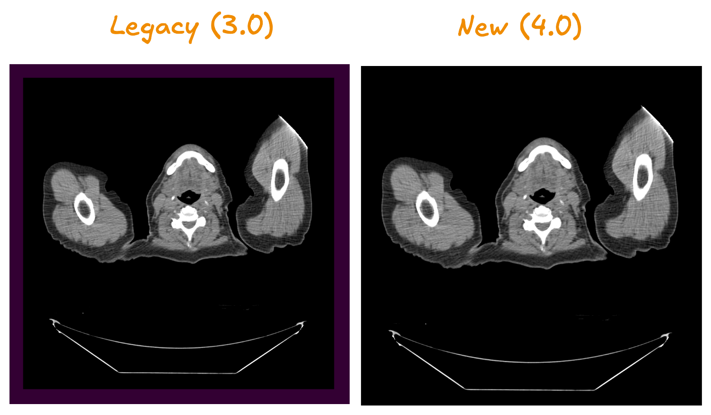

# Camera Field of View Changes

## What Changed

In version 4.x, images now display edge-to-edge in viewports without the 10% padding that was present in 3.x.

### Visual Difference

- **Before (3.x)**: Images had automatic padding around edges (configurable color for background)
- **After (4.x)**: Images fill the entire viewport



## How to Revert

If you need the old behavior with padding, add this configuration during initialization:

```javascript
import { init } from '@cornerstonejs/core';

init({
  rendering: {
    useLegacyCameraFOV: true,
  },
});
```

That's it. Your images will display with padding like they did in 3.x.

## Why We Changed This

The new approach provides better screen utilization and more accurate full-width display, especially important for modern high-resolution displays and mobile devices.
