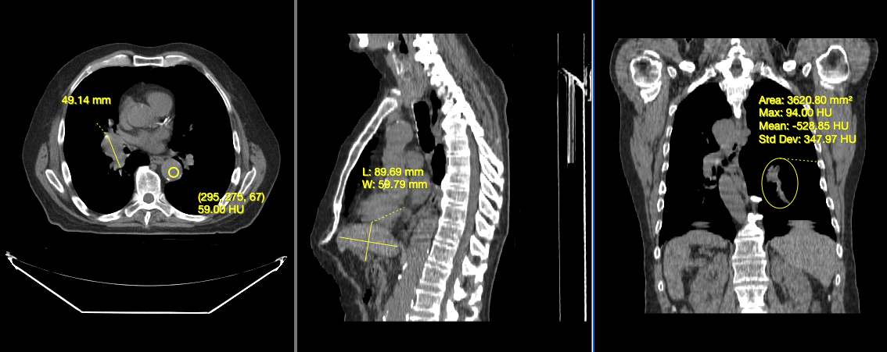

# Overview


`cornerstone3D` is a lightweight Javascript library for visualization of medical images in modern web browsers that support the HTML5 canvas element.
Using `cornerstone3D` and its accompanying libraries such as `cornerstone3DTools`, you can render all transfer syntaxes, manipulate and interact with images, annotate with various measurement tools, and render and edit segmentations.



## About Cornerstone-3D

This repository contains three projects:

- `/packages/cornerstone-render`: The rendering library equivalent of `cornerstone-core`
- `/packages/cornerstone-tools`: The tool library equivalent of `cornerstone-tools`
- `/packages/cornerstone-image-loader-streaming-volume`: For streaming the volumes into the viewport and progressively loading them
- `/demo`: Consumes all of the above libraries to demonstrate functionality in various `react` demo apps.

In an effort to slowly and intentionally grow the API surface area of these libraries,
we at times rely on functionality in their predecessors. In that same vein, the `demo`
project has a `helpers` folder containing functionality that many consumers of
these libraries would benefit from. These helper functions demonstrate how a consumer can:

- register an external metadata provider
- register an image and volume loader
- add metadata to the provider
- sort the imageIds and lots of other useful utility functions

At a later date, those helpers may make their
way back into the rendering and tool libraries.

## About this documentation

This documentation is generated [Docusaurus](https://docusaurus.io/) which uses
[TypeDoc](https://typedoc.org/) behind the scene as a plugin. The TypeDoc uses
a combination of Markdown and [TSDoc](https://tsdoc.org/) decorated API to generate
the static HTML, CSS, and JS you're reading now. The documentation is organized
as follows:

```bash
- Docs                            # Generated from markdown
  - Cornerstone-Core              # Cornerstone3D Core rendering
    - Introduction                # High level overview
    - Installation                # Installation of the library
    - Concepts                    # Cornerstone-Core building blocks
    - Usage                       # How to do X (basics)

  - Cornerstone-Tools             # Cornerstone3D Tools
    - Introduction                # High level overview
    - Installation                # Installation of the library
    - Concepts                    # Cornerstone-Tools building blocks
    - Usage                       # How to do X (basics)

- API                             # Generated from TypeScript + TSDoc
  - Cornerstone-render            # Index of libraries
  - Cornerstone-tools             # Tools library
  - Cornerstone-streaming-volume-loader # Rendering library
```

If a guide is no longer up-to-date, you can author a PR to update it by modifying
the files in `./packages/docs/docs/*.md`. Read more on how to contribute [here](../contribute/pull-request.md).
A new page can be created by creating a new `.md` file and updating the `sidebar.js` to add the page
to the sidebar.

API documentation can be amended by modifying the JS comments
or TypeScript definitions for the code in question. Only exported code will have
documentation generated for it.

## High level design considerations

These libraries expand upon and update the interfaces `cornerstone.js` provided
to better support volume rendering, 3D aware tools, and PET images support. These
interfaces and functionality are broadly identified as:

- Rendering / Renderer
- Image Loading / Image Loader
- Metadata Provider
- Tools

`@ohif/cornerstone-render` is a "rendering" library built on top of `vtk.js`.
which leverages `cornerstone`'s existing plumbing to integrate with image loaders and metadata providers. The `demo` package in this repository contains a simple "metadata provider", named "WADORSHeaderProvider", that allows for querying metadata by instance and
imageId.

This repository's `@ohif/cornerstone-tools` is a "tools" library that, once initialized, will listen for custom events emitted by `@ohif/cornerstone-render`. Please note, the event naming and handling overlaps the events and event handling in the `cornerstone-tools` library. If you attempt to use `cornerstone-tools` in tandem, you will likely encounter issues. As this is a possible use case, please don't hesitate to report any issues and propose potential solutions.
