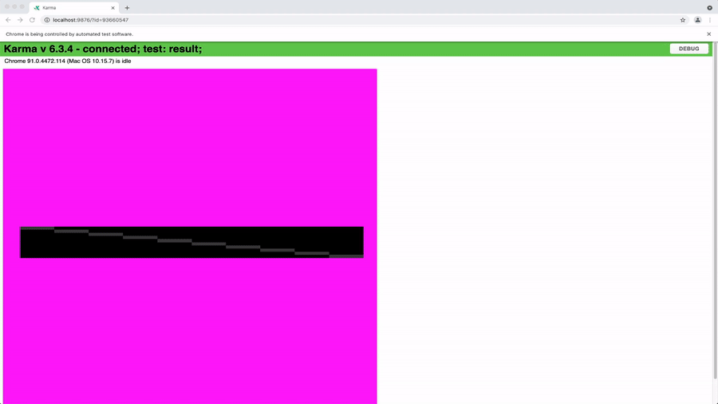

# Rendering Tests

To make sure our rendering pipeline doesn't break upon future modifications, we have
introduced the rendering tests for StackViewport and VolumeViewports.

Basically, when a new feature is introduced to the library, we take a screenshot of
how each viewport should render a sample data with various sized, interpolation and colors.
At testing, we compare the canvas output to the saved screenshots and throw an error if they don't match.

Testing happens in a Headless Chrome environment to make sure our tests can run in any servers. Therefore, you cannot visualize it by default,
however; if you want to take a look at each testing output images, you can edit the `Karma.config.js` and put
`browsers: ['Chrome']` instead of the default one which is `browsers: ['ChromeHeadlessNoSandbox']`
