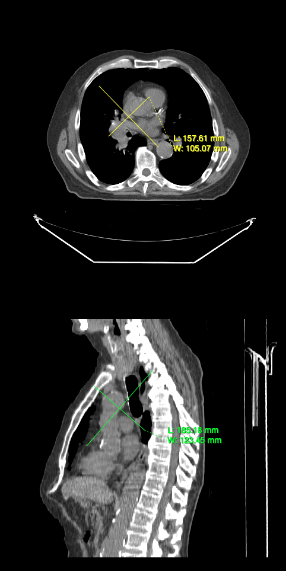

# Annotation Tools

In this tutorial, you will learn how to use annotation tools to annotate.

## Preface

In order to render a volume we need:

- HTMLDivElements to render different orientation of the volume (e.g., one for Axial, one for Sagittal)
- The path to the images (`imageId`s).

## Implementation

We have already stored images on a server for the purpose of this tutorial.

First let's create two HTMLDivElements and style them to contain viewports.

```js
const content = document.getElementById('content');

// element for axial view
const element1 = document.createElement('div');
element1.style.width = '500px';
element1.style.height = '500px';

// element for sagittal view
const element2 = document.createElement('div');
element2.style.width = '500px';
element2.style.height = '500px';

content.appendChild(element1);
content.appendChild(element2);
```

Next, we need a `renderingEngine`

```js
const renderingEngineId = 'myRenderingEngine';
const renderingEngine = new RenderingEngine(renderingEngineId);
```

Loading a volume is possible by using the `volumeLoader` API.

```js
// note we need to add the cornerstoneStreamingImageVolume: to
// use the streaming volume loader
const volumeId = 'cornerstoneStreamingImageVolume: myVolume';

// Define a volume in memory
const volume = await volumeLoader.createAndCacheVolume(volumeId, { imageIds });
```

We can then create a `viewport`s inside the renderingEngine by using the `setViewports` API.

```js
const viewportId1 = 'CT_AXIAL';
const viewportId2 = 'CT_SAGITTAL';

const viewportInput = [
  {
    viewportId: viewportId1,
    element: element1,
    type: ViewportType.ORTHOGRAPHIC,
    defaultOptions: {
      orientation: Enums.OrientationAxis.AXIAL,
    },
  },
  {
    viewportId: viewportId2,
    element: element2,
    type: ViewportType.ORTHOGRAPHIC,
    defaultOptions: {
      orientation: Enums.OrientationAxis.SAGITTAL,
    },
  },
];

renderingEngine.setViewports(viewportInput);
```

In order for us to use tools, add them inside `Cornerstone3DTools` internal state via the `addTool` API.

```js
addTool(BidirectionalTool);
```

Next, create a ToolGroup and add the tools we want to use.
ToolGroups makes it possible to share tools between multiple viewports, so we also need to let the ToolGroup know which viewports it should act on.

```js
const toolGroupId = 'myToolGroup';
const toolGroup = ToolGroupManager.createToolGroup(toolGroupId);

// Add tools to the ToolGroup
toolGroup.addTool(BidirectionalTool.toolName);

toolGroup.addViewport(viewportId1, renderingEngineId);
toolGroup.addViewport(viewportId2, renderingEngineId);
```

:::note Tip

Why do we add renderingEngineUID to the ToolGroup? Because viewportId is unique within each renderingEngine.

:::

Next, set the Tool to be active, which means we also need to define a bindings for the tool (which mouse button makes it active).

```js
// Set the
toolGroup.setToolActive(BidirectionalTool.toolName, {
  bindings: [
    {
      mouseButton: csToolsEnums.MouseBindings.Primary, // Left Click
    },
  ],
});
```

Let's load the volume and set the viewports to render the volume.

```js
// Set the volume to load
volume.load();

setVolumesForViewports(
  renderingEngine,
  [
    {
      volumeId,
      callback: ({ volumeActor }) => {
        // set the windowLevel after the volumeActor is created
        volumeActor
          .getProperty()
          .getRGBTransferFunction(0)
          .setMappingRange(-180, 220);
      },
    },
  ],
  [viewportId1, viewportId2]
);

// Render the image
renderingEngine.renderViewports([viewportId1, viewportId2]);
```

## Final code

```js
// Get Cornerstone imageIds and fetch metadata into RAM
const imageIds = await createImageIdsAndCacheMetaData({
  StudyInstanceUID:
    '1.3.6.1.4.1.14519.5.2.1.7009.2403.334240657131972136850343327463',
  SeriesInstanceUID:
    '1.3.6.1.4.1.14519.5.2.1.7009.2403.226151125820845824875394858561',
  wadoRsRoot: 'https://d3t6nz73ql33tx.cloudfront.net/dicomweb',
});

const content = document.getElementById('content');

// element for axial view
const element1 = document.createElement('div');
element1.style.width = '500px';
element1.style.height = '500px';

// element for sagittal view
const element2 = document.createElement('div');
element2.style.width = '500px';
element2.style.height = '500px';

content.appendChild(element1);
content.appendChild(element2);

const renderingEngineId = 'myRenderingEngine';
const renderingEngine = new RenderingEngine(renderingEngineId);

// note we need to add the cornerstoneStreamingImageVolume: to
// use the streaming volume loader
const volumeId = 'cornerstoneStreamingImageVolume: myVolume';

// Define a volume in memory
const volume = await volumeLoader.createAndCacheVolume(volumeId, {
  imageIds,
});

const viewportId1 = 'CT_AXIAL';
const viewportId2 = 'CT_SAGITTAL';

const viewportInput = [
  {
    viewportId: viewportId1,
    element: element1,
    type: ViewportType.ORTHOGRAPHIC,
    defaultOptions: {
      orientation: Enums.OrientationAxis.AXIAL,
    },
  },
  {
    viewportId: viewportId2,
    element: element2,
    type: ViewportType.ORTHOGRAPHIC,
    defaultOptions: {
      orientation: Enums.OrientationAxis.SAGITTAL,
    },
  },
];

renderingEngine.setViewports(viewportInput);

addTool(BidirectionalTool);

const toolGroupId = 'myToolGroup';
const toolGroup = ToolGroupManager.createToolGroup(toolGroupId);
toolGroup.addTool(BidirectionalTool.toolName);

toolGroup.addViewport(viewportId1, renderingEngineId);
toolGroup.addViewport(viewportId2, renderingEngineId);
toolGroup.setToolActive(BidirectionalTool.toolName, {
  bindings: [
    {
      mouseButton: csToolsEnums.MouseBindings.Primary, // Left Click
    },
  ],
});

// Set the volume to load
volume.load();

setVolumesForViewports(
  renderingEngine,
  [
    {
      volumeId,
      callback: ({ volumeActor }) => {
        // set the windowLevel after the volumeActor is created
        volumeActor
          .getProperty()
          .getRGBTransferFunction(0)
          .setMappingRange(-180, 220);
      },
    },
  ],
  [viewportId1, viewportId2]
);

// Render the image
renderingEngine.renderViewports([viewportId1, viewportId2]);
```

You should be able to annotate images with the tools you added.



## Read more

Learn more about:

- [ToolGroup](../concepts/cornerstone-tools/toolGroups.md)
- [Annotations](../concepts/cornerstone-tools/annotation/index.md)

For advanced usage of Stack Viewport, please visit <a href="/live-examples/volumeAnnotationTools.html" target="_blank">Volume Annotation Tools</a> example page.

:::note Tip

- Visit [Examples](examples.md#run-examples-locally) page to see how to run the examples locally.
- Check how to debug examples in the [Debugging](examples.md#debugging) section.

:::
