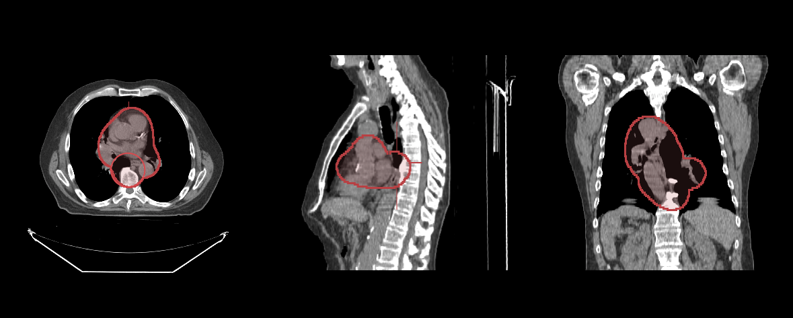

# Segmentation Tools

In this tutorial, you will learn how to use the segmentation tools to draw and edit segmentations.

## Preface

In order to render a volume we need:

- HTMLDivElements to render different orientation of the volume (e.g., one for Axial, one for Sagittal)
- The path to the images (`imageId`s).

## Implementation

We have already stored images on a server for the purpose of this tutorial.

First let's create three HTMLDivElements and style them to contain viewports for Axial, Sagittal, and Coronal views.

```js
const content = document.getElementById('content');

const viewportGrid = document.createElement('div');
viewportGrid.style.display = 'flex';
viewportGrid.style.flexDirection = 'row';

// element for axial view
const element1 = document.createElement('div');
element1.style.width = '500px';
element1.style.height = '500px';

// element for sagittal view
const element2 = document.createElement('div');
element2.style.width = '500px';
element2.style.height = '500px';

// element for coronal view
const element3 = document.createElement('div');
element3.style.width = '500px';
element3.style.height = '500px';

viewportGrid.appendChild(element1);
viewportGrid.appendChild(element2);
viewportGrid.appendChild(element3);

content.appendChild(viewportGrid);
```

For rendering Segmentations, add the `SegmentationDisplayTool`. This tool is used to render segmentations. For the brush tool, add the `BrushTool`. Both these tools should be added to the `Cornerstone3D` via the `addTool` API and the `ToolGroup`:

```js
addTool(SegmentationDisplayTool);
addTool(BrushTool);
```

for the toolGroup:

```js
const toolGroupId = 'CT_TOOLGROUP';
// Define tool groups to add the segmentation display tool to
const toolGroup = ToolGroupManager.createToolGroup(toolGroupId);

// Segmentation Tools
toolGroup.addTool(SegmentationDisplayTool.toolName);
toolGroup.addTool(BrushTool.toolName);
```

Next, in order for segmentations to be rendered, set the
`SegmentationDisplayTool` to be enabled:

```js
toolGroup.setToolEnabled(SegmentationDisplayTool.toolName);
```

And for having the brush tool active as the left mouse button is pressed, set the `BrushTool` to be active:

```js
toolGroup.setToolActive(BrushTool.toolName, {
  bindings: [{ mouseButton: csToolsEnums.MouseBindings.Primary }],
});
```

Next, we can deal with volume loading. First, let's load the actual
CT volume we are intending to use for rendering.

```js
const volumeName = 'CT_VOLUME_ID';
const volumeLoaderScheme = 'cornerstoneStreamingImageVolume';
const volumeId = `${volumeLoaderScheme}:${volumeName}`;

// Define a volume in memory for CT
const volume = await volumeLoader.createAndCacheVolume(volumeId, {
  imageIds,
});
```

We need another volume for segmentation (we don't want to modify the CT volume for segmentation). We can use the CT volume (`volumeId`) as a reference for metadata to create a new volume for segmentation.

```js
const segmentationId = 'MY_SEGMENTATION_ID';

// Create a segmentation of the same resolution as the source data for the CT volume
await volumeLoader.createAndCacheDerivedVolume(volumeId, {
  volumeId: segmentationId,
});
```

Then, add the created segmentation to the `Cornerstone3DTools` segmentation state. This is done via the `addSegmentation` API:

```js
// Add the segmentations to state. As seen the labelmap data
// which is the cached volumeId is provided to the state
segmentation.addSegmentations([
  {
    segmentationId,
    representation: {
      // The type of segmentation
      type: csToolsEnums.SegmentationRepresentations.Labelmap,
      // The actual segmentation data, in the case of labelmap this is a
      // reference to the source volume of the segmentation.
      data: {
        volumeId: segmentationId,
      },
    },
  },
]);
```

:::note Important
Creation and addition of a segmentation to the `Cornerstone3DTools` segmentation state does not render it on the viewports. `Cornerstone3DTools` have decoupled `Segmentation` from a `Segmentation Representation`. In short, the `Segmentation` has the necessary data
for rendering different `Segmentation Representation`s such as `Labelmap`, `Contour` (not supported yet, see roadmap). So you can have multiple `representation` of a single `Segmentation`. Read more at the end of this tutorial.
:::

Let's create a rendering engine and add viewports, and let the ToolGroup know about the viewports it is acting on:

```js
// Instantiate a rendering engine
const renderingEngineId = 'myRenderingEngine';
const renderingEngine = new RenderingEngine(renderingEngineId);

// Create the viewports
const viewportId1 = 'CT_AXIAL';
const viewportId2 = 'CT_SAGITTAL';
const viewportId3 = 'CT_CORONAL';

const viewportInputArray = [
  {
    viewportId: viewportId1,
    type: ViewportType.ORTHOGRAPHIC,
    element: element1,
    defaultOptions: {
      orientation: Enums.OrientationAxis.AXIAL,
    },
  },
  {
    viewportId: viewportId2,
    type: ViewportType.ORTHOGRAPHIC,
    element: element2,
    defaultOptions: {
      orientation: Enums.OrientationAxis.SAGITTAL,
    },
  },
  {
    viewportId: viewportId3,
    type: ViewportType.ORTHOGRAPHIC,
    element: element3,
    defaultOptions: {
      orientation: Enums.OrientationAxis.CORONAL,
    },
  },
];

renderingEngine.setViewports(viewportInputArray);

toolGroup.addViewport(viewportId1, renderingEngineId);
toolGroup.addViewport(viewportId2, renderingEngineId);
toolGroup.addViewport(viewportId3, renderingEngineId);
```

Let's set the volume to load and set it on the viewports

```js
/ Set the volume to load
  volume.load();

  // Set volumes on the viewports
  await setVolumesForViewports(
    renderingEngine,
    [
      {
        volumeId,
        callback: ({ volumeActor }) => {
          // set the windowLevel after the volumeActor is created
          volumeActor
            .getProperty()
            .getRGBTransferFunction(0)
            .setMappingRange(-180, 220);
        },
      },
    ],
    [viewportId1, viewportId2, viewportId3]
  );
```

Finally, we create a labelmap representation of the segmentation and
add it to the toolGroup

```js
// Add the segmentation representation to the toolGroup
await segmentation.addSegmentationRepresentations(toolGroupId, [
  {
    segmentationId,
    type: csToolsEnums.SegmentationRepresentations.Labelmap,
  },
]);

// Render the image
renderingEngine.renderViewports([viewportId1, viewportId2, viewportId3]);
```

## Final code

```js
// Get Cornerstone imageIds and fetch metadata into RAM
const imageIds = await createImageIdsAndCacheMetaData({
  StudyInstanceUID:
    '1.3.6.1.4.1.14519.5.2.1.7009.2403.334240657131972136850343327463',
  SeriesInstanceUID:
    '1.3.6.1.4.1.14519.5.2.1.7009.2403.226151125820845824875394858561',
  wadoRsRoot: 'https://d3t6nz73ql33tx.cloudfront.net/dicomweb',
});

const content = document.getElementById('content');

const viewportGrid = document.createElement('div');
viewportGrid.style.display = 'flex';
viewportGrid.style.flexDirection = 'row';

// element for axial view
const element1 = document.createElement('div');
element1.style.width = '500px';
element1.style.height = '500px';

// element for sagittal view
const element2 = document.createElement('div');
element2.style.width = '500px';
element2.style.height = '500px';

// element for coronal view
const element3 = document.createElement('div');
element3.style.width = '500px';
element3.style.height = '500px';

viewportGrid.appendChild(element1);
viewportGrid.appendChild(element2);
viewportGrid.appendChild(element3);

content.appendChild(viewportGrid);

addTool(SegmentationDisplayTool);
addTool(BrushTool);

const volumeName = 'CT_VOLUME_ID';
const toolGroupId = 'CT_TOOLGROUP';
const volumeLoaderScheme = 'cornerstoneStreamingImageVolume';
const volumeId = `${volumeLoaderScheme}:${volumeName}`;
const segmentationId = 'MY_SEGMENTATION_ID';
// Define tool groups to add the segmentation display tool to
const toolGroup = ToolGroupManager.createToolGroup(toolGroupId);

// Segmentation Tools
toolGroup.addTool(SegmentationDisplayTool.toolName);
toolGroup.addTool(BrushTool.toolName);
toolGroup.setToolEnabled(SegmentationDisplayTool.toolName);

toolGroup.setToolActive(BrushTool.toolName, {
  bindings: [{ mouseButton: csToolsEnums.MouseBindings.Primary }],
});

// Define a volume in memory for CT
const volume = await volumeLoader.createAndCacheVolume(volumeId, {
  imageIds,
});

// Create a segmentation of the same resolution as the source data for the CT volume
await volumeLoader.createAndCacheDerivedVolume(volumeId, {
  volumeId: segmentationId,
});

// Add the segmentations to state
segmentation.addSegmentations([
  {
    segmentationId,
    representation: {
      // The type of segmentation
      type: csToolsEnums.SegmentationRepresentations.Labelmap,
      // The actual segmentation data, in the case of labelmap this is a
      // reference to the source volume of the segmentation.
      data: {
        volumeId: segmentationId,
      },
    },
  },
]);

// Instantiate a rendering engine
const renderingEngineId = 'myRenderingEngine';
const renderingEngine = new RenderingEngine(renderingEngineId);

// Create the viewports
const viewportId1 = 'CT_AXIAL';
const viewportId2 = 'CT_SAGITTAL';
const viewportId3 = 'CT_CORONAL';

const viewportInputArray = [
  {
    viewportId: viewportId1,
    type: ViewportType.ORTHOGRAPHIC,
    element: element1,
    defaultOptions: {
      orientation: Enums.OrientationAxis.AXIAL,
    },
  },
  {
    viewportId: viewportId2,
    type: ViewportType.ORTHOGRAPHIC,
    element: element2,
    defaultOptions: {
      orientation: Enums.OrientationAxis.SAGITTAL,
    },
  },
  {
    viewportId: viewportId3,
    type: ViewportType.ORTHOGRAPHIC,
    element: element3,
    defaultOptions: {
      orientation: Enums.OrientationAxis.CORONAL,
    },
  },
];

renderingEngine.setViewports(viewportInputArray);

toolGroup.addViewport(viewportId1, renderingEngineId);
toolGroup.addViewport(viewportId2, renderingEngineId);
toolGroup.addViewport(viewportId3, renderingEngineId);

// Set the volume to load
volume.load();

// Set volumes on the viewports
await setVolumesForViewports(
  renderingEngine,
  [
    {
      volumeId,
    },
  ],
  [viewportId1, viewportId2, viewportId3]
);

// // Add the segmentation representation to the toolGroup
await segmentation.addSegmentationRepresentations(toolGroupId, [
  {
    segmentationId,
    type: csToolsEnums.SegmentationRepresentations.Labelmap,
  },
]);

// Render the image
renderingEngine.renderViewports([viewportId1, viewportId2, viewportId3]);
```

You should be able to draw segmentations with the brush tool



## Read more

Learn more about:

- [Segmentation](../concepts/cornerstone-tools/segmentation/index.md)
- [SegmentationDisplay](../concepts/cornerstone-tools/segmentation/segmentationDisplay.md)
- [SegmentationTools](../concepts/cornerstone-tools/segmentation/segmentation-tools.md)

For advanced usage of Stack Viewport, please visit <a href="/live-examples/segmentationRendering.html" target="_blank">Segmentation Rendering</a> example page.

:::note Tip

- Visit [Examples](examples.md#run-examples-locally) page to see how to run the examples locally.
- Check how to debug examples in the [Debugging](examples.md#debugging) section.

:::
