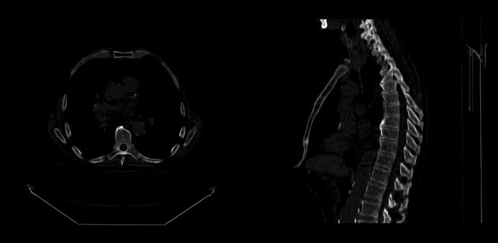

# Render Volume

In this tutorial, you will learn how to render a volume.

## Preface

In order to render a volume we need:

- Initialize cornerstone and related libraries.
- HTMLDivElements to render different orientation of the volume (e.g., one for Axial, one for Sagittal)
- The path to the images (`imageId`s).

## Implementation

### Step 1: Initialize cornerstone and related libraries

```js
import { init as coreInit } from '@cornerstonejs/core';
import { init as dicomImageLoaderInit } from '@cornerstonejs/dicom-image-loader';

await coreInit();
await dicomImageLoaderInit();
```

We have already stored images on a server for the purpose of this tutorial.

First let's create two HTMLDivElements and style them to contain viewports.

```js
const content = document.getElementById('content');

const viewportGrid = document.createElement('div');
viewportGrid.style.display = 'flex';
viewportGrid.style.flexDirection = 'row';

// element for axial view
const element1 = document.createElement('div');
element1.style.width = '500px';
element1.style.height = '500px';

// element for sagittal view
const element2 = document.createElement('div');
element2.style.width = '500px';
element2.style.height = '500px';

viewportGrid.appendChild(element1);
viewportGrid.appendChild(element2);

content.appendChild(viewportGrid);
```

Next, we need a `renderingEngine`

```js
const renderingEngineId = 'myRenderingEngine';
const renderingEngine = new RenderingEngine(renderingEngineId);
```

Loading a volume is possible by using the `volumeLoader` API.

```js
const volumeId = 'myVolume';

// Define a volume in memory
const volume = await volumeLoader.createAndCacheVolume(volumeId, { imageIds });
```

We can then create a `viewport`s inside the renderingEngine by using the `setViewports` API.

```js
const viewportId1 = 'CT_AXIAL';
const viewportId2 = 'CT_SAGITTAL';

const viewportInput = [
  {
    viewportId: viewportId1,
    element: element1,
    type: ViewportType.ORTHOGRAPHIC,
    defaultOptions: {
      orientation: Enums.OrientationAxis.AXIAL,
    },
  },
  {
    viewportId: viewportId2,
    element: element2,
    type: ViewportType.ORTHOGRAPHIC,
    defaultOptions: {
      orientation: Enums.OrientationAxis.SAGITTAL,
    },
  },
];

renderingEngine.setViewports(viewportInput);
```

RenderingEngine will handle creation of the viewports. Next, we need to perform the `load` on the volume.

:::note Important
Defining a volume is not the same as loading it.
:::

```js
// Set the volume to load
volume.load();
```

Finally, let the viewports know about the volume.

```js
setVolumesForViewports(
  renderingEngine,
  [{ volumeId }],
  [viewportId1, viewportId2]
);

// Render the image
renderingEngine.renderViewports([viewportId1, viewportId2]);
```

## Final code

<details>
<summary>Click to see the full code</summary>

```js
import {
  init as coreInit,
  RenderingEngine,
  Enums,
  volumeLoader,
  setVolumesForViewports,
} from '@cornerstonejs/core';
import { init as dicomImageLoaderInit } from '@cornerstonejs/dicom-image-loader';
import { createImageIdsAndCacheMetaData } from '../../../../utils/demo/helpers';

const { ViewportType } = Enums;

const content = document.getElementById('content');

const viewportGrid = document.createElement('div');
viewportGrid.style.display = 'flex';
viewportGrid.style.flexDirection = 'row';

// element for axial view
const element1 = document.createElement('div');
element1.style.width = '500px';
element1.style.height = '500px';

// element for sagittal view
const element2 = document.createElement('div');
element2.style.width = '500px';
element2.style.height = '500px';

viewportGrid.appendChild(element1);
viewportGrid.appendChild(element2);

content.appendChild(viewportGrid);
// ============================= //

async function run() {
  await coreInit();
  await dicomImageLoaderInit();

  // Get Cornerstone imageIds and fetch metadata into RAM
  const imageIds = await createImageIdsAndCacheMetaData({
    StudyInstanceUID:
      '1.3.6.1.4.1.14519.5.2.1.7009.2403.334240657131972136850343327463',
    SeriesInstanceUID:
      '1.3.6.1.4.1.14519.5.2.1.7009.2403.226151125820845824875394858561',
    wadoRsRoot: 'https://d14fa38qiwhyfd.cloudfront.net/dicomweb',
  });

  // Instantiate a rendering engine
  const renderingEngineId = 'myRenderingEngine';
  const renderingEngine = new RenderingEngine(renderingEngineId);

  const volumeId = 'myVolume';

  // Define a volume in memory
  const volume = await volumeLoader.createAndCacheVolume(volumeId, {
    imageIds,
  });

  const viewportId1 = 'CT_AXIAL';
  const viewportId2 = 'CT_SAGITTAL';

  const viewportInput = [
    {
      viewportId: viewportId1,
      element: element1,
      type: ViewportType.ORTHOGRAPHIC,
      defaultOptions: {
        orientation: Enums.OrientationAxis.AXIAL,
      },
    },
    {
      viewportId: viewportId2,
      element: element2,
      type: ViewportType.ORTHOGRAPHIC,
      defaultOptions: {
        orientation: Enums.OrientationAxis.SAGITTAL,
      },
    },
  ];

  renderingEngine.setViewports(viewportInput);

  volume.load();

  setVolumesForViewports(
    renderingEngine,
    [{ volumeId }],
    [viewportId1, viewportId2]
  );
}

run();
```

</details>

You should be able to see:

<div style={{width:"75%"}}>



</div>

## Read more

Learn more about:

- [volumes](../concepts/cornerstone-core/volumes.md)
- [rendering engine](../concepts/cornerstone-core/renderingEngine.md)
- [viewport](../concepts/cornerstone-core/viewports.md)

For advanced usage of Volume Viewport, please visit <a href="/live-examples/volumeAPI.html" target="_blank">VolumeViewport API</a> example page.

:::note Tip

- Visit [Examples](../examples.md) page to see how to run the examples locally.

:::
