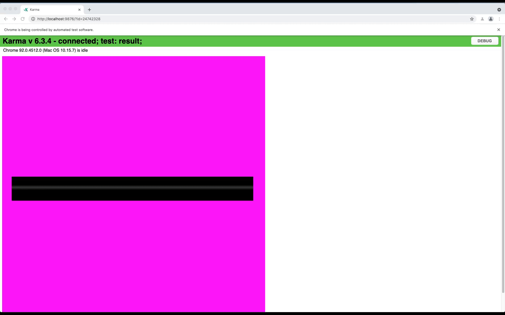

# Writing Karma Tests

To make sure our rendering and tools don't break upon future modifications, we have
written tests for them. Rendering tests includes comparing the rendered images
with the expected images. Tools tests includes comparing the output of the tools
with the expected output.

### Running Karma Tests Locally

You can run `yarn run test` to run all tests locally.
By default, `karma.conf.js` will run the tests in a headless chrome browser to make
sure our tests can run in any servers. Therefore, you cannot visualize it by default. In order
to run the tests and visually inspect the results, you can run the tests by changing the
`karma.conf.js` file to have `browsers: ['Chrome']` instead of `browsers: ['ChromeHeadless']`.

### Running Only One Karma Test Locally

You can use `karma` specifiers such as `describe` instead of (`describe`) and `fit` instead
of (`it`) to run only one test.
